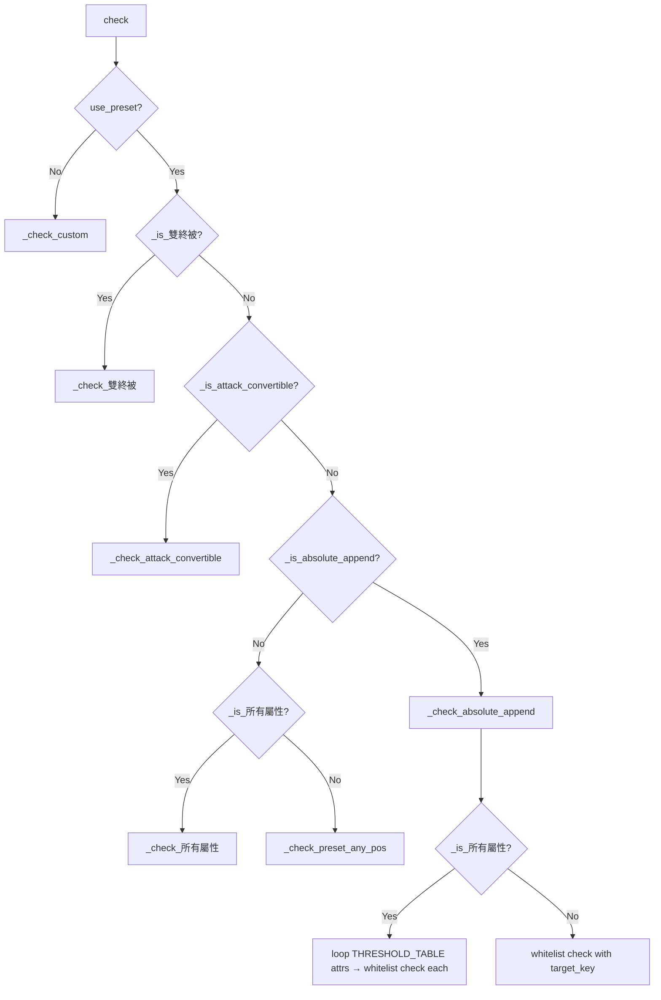

# 條件規則系統 v2 Technical Spec

> **Created**: 2026-04-12
> **Requirements**: [1-requirements.md](./1-requirements.md)
> **Feasibility**: [0-feasibility-study.md](./0-feasibility-study.md)
> **Approach**: Option D（Hybrid — `_classify_line` extraction + `_check_absolute_append` dispatch）

## 1. Requirement Summary

**Problem**: 條件系統以「排列組合」而非「目標屬性達成」為判定核心，導致 (1) 預設規則認知落差、(2) 自訂模式過度彈性、(3) 絕對附加語意失焦、(4) 說明文字無法差異化。

**Goals**: 以 FR-1..19 + NFR-1..6 定義的完整規格為目標（見 requirements）。

**Scope**: 5 個實作 Area — (1) Preset test lockdown (2) Custom mode merge (3) Absolute append whitelist (4) Description text (5) Cube type string cleanup。

### Tolerance 政策修正

> **重要**：`1-requirements.md` FR-12.1(d)(e) 原寫「所有組合均沿用 `_OCR_TOLERANCE`」，但現有 code 故意不對爆擊傷害 / 冷卻套用 tolerance（`condition.py:573,576,1014` — 因 1% 和 3% 差距太小，tolerance=2 會讓 1% 通過 3% 門檻 = FP）。本 spec 以 **code 現行行為為準**：(a)(b)(c) 套用 tolerance，(d)(e) 不套用。

### Requirements Amendment (tolerance policy)

`1-requirements.md` FR-12.1 / C6 原文寫「所有組合均沿用 `_OCR_TOLERANCE = 2`」。本 spec 修正為：

| Combo | Tolerance | Reason |
|-------|-----------|--------|
| (a) 同種主屬×2 | `_OCR_TOLERANCE` (2) | 9% 和 7% 差距夠大，tolerance 不會讓罕見通過 S 潛 |
| (b) 全屬×2 | `_OCR_TOLERANCE` (2) | 同上 |
| (c) MaxHP×2 | `_OCR_TOLERANCE` (2) | 12% 和 9% 差距夠大 |
| (d) 冷卻×2 | **0**（不套用） | 冷卻值只有 1，無 tolerance 需求 |
| (e) 爆擊×2 | **0**（不套用） | 1% 和 3% 差距僅 2，tolerance=2 會讓 1% 通過 3% 門檻 = **FP** (condition.py:1014) |

此修正需在 `/feature-dev` 前同步更新 `1-requirements.md` FR-12.1 的 (d)(e) 小節。

## 2. Existing Code Analysis

### 2.1 Files Requiring Changes

| File | Area | Change Type |
|------|------|-------------|
| `app/core/condition.py` | 1,3,4 | 抽取 classifier、新增 absolute dispatch、修改 summary |
| `app/gui/condition_editor.py` | 2 | Mode merge、position combo、value min |
| `app/models/config.py` | 5 | Cube type 字串 migration — load 時 auto-convert 無後綴 → 有後綴 |
| `app/gui/settings_panel.py` | 5 | （視需要 — cube type 字串目前只在 condition.py 定義） |
| `tests/test_condition.py` | 1,3,4,5 | 新增 lockdown tests、whitelist tests、summary tests |

### 2.2 Related Modules — Reusable

| Module | Location | Reuse |
|--------|----------|-------|
| `_check_line()` | condition.py:556 | 抽取為 `_classify_line` wrapper — 行為不變 |
| `_run_preset_any_pos()` | condition.py:581 | **不改動** — 仍呼叫 `_check_line` |
| `_check_attack_convertible()` | condition.py:928 | dispatch 模式範本 |
| `_check_所有屬性()` | condition.py:954 | 非 absolute cube 仍沿用 |
| `_check_custom()` | condition.py:977 | `position=0` + `position>=1` 語意已支援合併 |
| `THRESHOLD_TABLE` | condition.py:404-467 | S 潛 / 罕見值的 single source |

### 2.3 Current Dispatch Order vs Proposed

```
Current:  雙終被 → 所有屬性 → attack_convertible → preset_any_pos
Proposed: 雙終被 → attack_convertible → absolute_append → 所有屬性 → preset_any_pos
```

## 3. Technical Solution

### 3.1 Architecture (Dispatch Flow)



### 3.2 Core Logic — `_classify_line` Extraction

#### 3.2.1 New Function: `_classify_line`

```python
# condition.py — insert before _check_line (around line 555)

from dataclasses import dataclass
from typing import Literal

MatchKind = Literal[
    "target",       # matches target_key (e.g., STR%, DEX%, MaxHP%)
    "all_stats",    # matches 全屬性%
    "crit3",        # matches 爆擊傷害% >= 3
    "cooldown",     # matches 技能冷卻時間 >= 1
]

def _classify_line(
    line: PotentialLine,
    target_key: str,
    target_min: int,
    all_stats_min: int | None,
    accept_crit3: bool,
    accept_cooldown: bool = False,
    tolerance: int = 0,
) -> MatchKind | None:
    """分類單行潛能的 match 類型。回傳 None = 不合格。"""
    if line.attribute == target_key and line.value + tolerance >= target_min:
        return "target"
    if all_stats_min is not None and line.attribute == "全屬性%" and line.value + tolerance >= all_stats_min:
        return "all_stats"
    # 爆擊傷害不套用容錯（1% 和 3% 差距太小）
    if accept_crit3 and line.attribute == "爆擊傷害%" and line.value >= 3:
        return "crit3"
    # 技能冷卻時間不套用容錯
    if accept_cooldown and line.attribute == "技能冷卻時間" and line.value >= 1:
        return "cooldown"
    return None
```

#### 3.2.2 Refactored `_check_line`

```python
def _check_line(
    line: PotentialLine,
    target_key: str,
    target_min: int,
    all_stats_min: int | None,
    accept_crit3: bool,
    accept_cooldown: bool = False,
    tolerance: int = 0,
) -> bool:
    """檢查單行潛能是否合格（wrapper）。"""
    return _classify_line(
        line, target_key, target_min, all_stats_min,
        accept_crit3, accept_cooldown, tolerance,
    ) is not None
```

**行為等價保證**：`_check_line` 的 bool 語意完全不變 → `_run_preset_any_pos` 不需任何修改。

### 3.3 Core Logic — `_check_absolute_append`

#### 3.3.1 Whitelist Combo 資料結構

```python
# condition.py — ConditionChecker.__init__ 內，_is_absolute_append 為 True 時建立

@dataclass(frozen=True)
class _WhitelistCombo:
    """白名單組合定義 — 精簡版，_check_absolute_append 直接比對 target_key + target_min。"""
    target_key: str       # OCR attribute key (e.g., "STR%", "全屬性%", "爆擊傷害%")
    target_min: int       # S 潛門檻（或固定常數：爆擊=3, 冷卻=1）
    tolerance: int        # (a)(b)(c) = _OCR_TOLERANCE; (d)(e) = 0
```

> **設計備註**：`_classify_line` 的 `MatchKind` 回傳值與 `_WhitelistCombo` 無直接耦合。白名單比對在 `_check_absolute_append` 中直接用 `target_key` + `target_min` + `tolerance`，不走 `_classify_line`（因白名單每個 combo 只有單一 attribute type，直接比對更清晰且不依賴 classifier 的邏輯順序）。`_classify_line` 保留給 `_check_line` wrapper 使用，未來擴充時可共用。

#### 3.3.2 `__init__` Whitelist 建立邏輯

> **關鍵**：現有 `__init__` 在 `_is_所有屬性` 判定處有 **early return**（condition.py:850-853），會跳過後續所有初始化。必須在此 early return **之前**設定 `_is_absolute_append` flag，否則 `所有屬性 + 絕對附加` 永遠走不到白名單路徑。

```python
# In ConditionChecker.__init__
# ── INSERT BEFORE existing 所有屬性 early return (line 850) ──

self._is_absolute_append = (
    self._num_lines == 2
    and attr != _ATTACK_CONVERTIBLE  # 直接比對 attr 而非 flag — 因為此時 _is_attack_convertible 尚未初始化
    and not self._is_雙終被
    and config.cube_type in _TWO_LINE_CUBE_TYPES
)

if self._is_absolute_append:
    # 所有屬性 case: _is_所有屬性 仍設為 True，但白名單在 _check_absolute_append 內部處理
    self._is_所有屬性 = attr == "所有屬性"
    equip_thresholds = THRESHOLD_TABLE.get(resolved, {})
    self._equip_thresholds = equip_thresholds  # 供 _build_whitelist 使用
    self._whitelist_combos = self._build_whitelist(resolved, attr)
    self._valid = True
    return  # 不再走舊的 所有屬性/preset 初始化路徑

# ── EXISTING 所有屬性 early return (line 850) ── 此後僅對 non-absolute cubes 生效
self._is_所有屬性 = attr == "所有屬性"
if self._is_所有屬性:
    ...  # 既有邏輯不變
```

#### 3.3.3 `_build_whitelist` Method

```python
def _build_whitelist(self, resolved_equip: str, target_attr: str) -> list[_WhitelistCombo]:
    """依裝備等級建立白名單 combo list。"""
    combos: list[_WhitelistCombo] = []
    equip_thresholds = THRESHOLD_TABLE.get(resolved_equip, {})

    if self._is_所有屬性:
        # 所有屬性模式：每種主屬都產生 combo
        attrs_to_check = [a for a in ("STR", "DEX", "INT", "LUK") if a in equip_thresholds]
    elif target_attr in equip_thresholds:
        attrs_to_check = [target_attr]
    else:
        attrs_to_check = []

    for attr in attrs_to_check:
        (s_val, _r_val), all_stats = equip_thresholds[attr]
        ocr_key = _attr_to_ocr_key(attr)
        # (a) 同種主屬 × 2
        combos.append(_WhitelistCombo(target_key=ocr_key, target_min=s_val, tolerance=self._tolerance))

    # (b) 全屬 × 2（若裝備有全屬門檻）
    all_stats_entry = equip_thresholds.get("全屬性")
    if all_stats_entry:
        (all_s, _all_r), _ = all_stats_entry
        combos.append(_WhitelistCombo(target_key="全屬性%", target_min=all_s, tolerance=self._tolerance))

    # (c) MaxHP × 2
    hp_entry = equip_thresholds.get("MaxHP")
    if hp_entry:
        (hp_s, _hp_r), _ = hp_entry
        combos.append(_WhitelistCombo(target_key="MaxHP%", target_min=hp_s, tolerance=self._tolerance))

    # (d) 冷卻 × 2（僅帽子）— 不套用 tolerance
    if self._is_hat:
        combos.append(_WhitelistCombo(target_key="技能冷卻時間", target_min=1, tolerance=0))

    # (e) 爆擊傷害 × 2（僅手套）— 不套用 tolerance
    if self._is_glove:
        combos.append(_WhitelistCombo(target_key="爆擊傷害%", target_min=3, tolerance=0))

    return combos
```

#### 3.3.4 `_check_absolute_append` Method

```python
def _check_absolute_append(self, lines: list[PotentialLine]) -> bool:
    """絕對附加白名單：兩排必須命中同一 combo type。"""
    l0, l1 = lines[0], lines[1]
    for combo in self._whitelist_combos:
        if (l0.attribute == combo.target_key
            and l0.value + combo.tolerance >= combo.target_min
            and l1.attribute == combo.target_key
            and l1.value + combo.tolerance >= combo.target_min):
            return True
    return False
```

**設計決策**：
- 直接比對 `attribute == target_key`（兩排同 attribute name → Q3 同種定義自動滿足）
- 不走 `_classify_line` 間接路徑（因白名單每個 combo 只有一種 attribute，直接比對更清晰）
- `_classify_line` 仍保留給 `_check_line` 使用 — extensibility 目的

### 3.4 Area 2 — Custom Mode Merge

#### 3.4.1 Constants

```python
# condition_editor.py — replace lines 25-28
_MODE_PRESET = "預設規則"
_MODE_CUSTOM = "自訂條件"
_MODES = [_MODE_PRESET, _MODE_CUSTOM]
```

#### 3.4.2 Position Combo — Always Visible

```python
# _refresh_position_combos — replace lines 237-255
def _refresh_position_combos(self) -> None:
    """刷新所有排的 position combo：自訂模式下永遠顯示。"""
    is_custom = self._current_mode() == _MODE_CUSTOM
    for row in self._custom_rows:
        row.position_combo.setVisible(is_custom)
    if not is_custom:
        return
    for row in self._custom_rows:
        current = row.position_combo.currentData()
        row.position_combo.blockSignals(True)
        row.position_combo.clear()
        row.position_combo.addItem("任一排", 0)  # NEW: position=0
        for i in range(1, self._num_lines + 1):
            row.position_combo.addItem(f"第 {i} 排", i)
        if current is not None:
            idx = row.position_combo.findData(current)
            if idx >= 0:
                row.position_combo.setCurrentIndex(idx)
        row.position_combo.blockSignals(False)
```

#### 3.4.3 `apply_to_config` — Always Read Position

```python
# condition_editor.py line 446 — remove mode-conditional branch
config.custom_lines = [
    LineCondition(
        attribute=row.attr_combo.currentText(),
        min_value=row.value_spin.value(),
        position=row.position_combo.currentData() or 0,  # always from combo
    )
    for row in self._custom_rows
]
```

#### 3.4.4 `load_from_config` — Simplified

```python
# condition_editor.py lines 460-466 — replace mode inference
if config.use_preset:
    mode = _MODE_PRESET
else:
    mode = _MODE_CUSTOM  # unified — position per row
self.mode_combo.setCurrentText(mode)
```

#### 3.4.5 `_max_rows`

```python
def _max_rows(self) -> int:
    # 保留合理上限，相容舊 OR config（可能 >_num_lines）
    return max(self._num_lines, _MAX_OR_ROWS)
```

#### 3.4.6 Value Spinbox Min

```python
# In _add_custom_row or _on_attr_changed for custom rows:
# Read min from THRESHOLD_TABLE "罕見" column
# Special cases: 爆擊傷害 → min=3, 技能冷卻時間 → min=1
```

具體實作：在 `_CustomRowWidget` 的 attr_combo `currentTextChanged` signal handler 中，依裝備類型 + 屬性名稱查 `THRESHOLD_TABLE[resolved_equip][attr][0][1]`（罕見值），設定 `value_spin.setMinimum()`。爆擊傷害 / 冷卻不在 THRESHOLD_TABLE，hardcode `min=3` / `min=1`。

### 3.5 Area 4 — Description Text

#### 3.5.1 `generate_condition_summary` 修改

在 `num_lines == 2` 分支（condition.py:734-746）之前插入 absolute append 專用分支：

```python
# 絕對附加白名單 summary
if num_lines == 2 and config.cube_type in _TWO_LINE_CUBE_TYPES:
    return _generate_absolute_summary(resolved, is_glove, is_hat, attr)
```

`_generate_absolute_summary` 列出白名單 5 類的具體數值（依 THRESHOLD_TABLE S 潛欄 + equip_type），格式：
```
僅支援以下組合:
  · {attr} {s_val}% × 2 (同種主屬)
  · 全屬性 {all_s}% × 2
  · MaxHP {hp_s}% × 2
  · 爆擊傷害 3% × 2 (手套)    ← 僅 is_glove
  · 技能冷卻時間 -1 秒 × 2 (帽子)  ← 僅 is_hat
```

#### 3.5.2 一般方塊 Summary 補充

在 3-line summary（condition.py:748-763）結尾新增：

```python
# 補充支援範圍
suffix = []
if is_glove:
    suffix.append("支援雙爆")
if is_hat:
    suffix.append("支援 -2 冷卻")
suffix.append("支援 3S、雙 S")
parts.append(f"  ({', '.join(suffix)})")
```

FR-18：手套 summary 的「雙爆」不含 % 數字（已由上方格式滿足）。

### 3.6 Area 5 — Cube Type String Cleanup

```python
# condition.py:623 — remove unsuffixed string
_TWO_LINE_CUBE_TYPES = {"絕對附加方塊 (僅洗兩排)"}  # was {"絕對附加方塊", "..."}
```

## 4. Risks and Dependencies

| # | Risk | Severity | Mitigation |
|---|------|----------|------------|
| R1 | Dispatch 重排可能影響既有 `所有屬性` + 3-line cube 行為 | Medium | 所有屬性 path 僅在 `_is_absolute_append=False` 時進入 → 3-line cube 不受影響（`_is_absolute_append` 需 `num_lines==2`） |
| R2 | `_classify_line` 抽取若有 subtle 行為差異 → 全面 regression | Medium | 抽取為機械搬移（零邏輯改動），wrapper `_check_line` 行為等價 → 既有 tests 全覆蓋 |
| R3 | Custom mode merge 可能遺漏 edge case（position swap、duplicate attr） | Medium | 現有 `_swap_or_attr` / position swap 邏輯需審查是否相容新「per-row position」模式 |
| R4 | Summary text 更新與 checker 邏輯 drift | Low | `_generate_absolute_summary` 讀相同 THRESHOLD_TABLE 常數 |
| R5 | 舊 config 載入 — 無後綴 cube type 字串 | Low | Config migration：`load` 時若遇 `"絕對附加方塊"`（無後綴），自動轉為有後綴版本 |

| Dependency | Impact |
|------------|--------|
| `_run_preset_any_pos` 不改動 | 白名單不影響既有 3-line preset 判定 |
| `_check_custom` 不改動 | Mode merge 只影響 UI 層，backend 語意已支援 |
| `THRESHOLD_TABLE` 不改動 | 白名單 + summary 讀取不改源 |

## 5. Work Breakdown

### Phase 1: Area 1 — Test Lockdown（不改 code）

| # | Task | Est. |
|---|------|------|
| 1.1 | 手套 lockdown tests: crit×1+主屬×2, crit×2+主屬×1, crit×3 | 0.5h |
| 1.2 | 帽子 lockdown tests: cooldown×1+主屬×2, cooldown×2+主屬×1, cooldown×3 | 0.5h |
| 1.3 | 包含全屬性 case（FR-4 鎖定） | 0.25h |
| 1.4 | `uv run pytest` 全綠確認 | — |

### Phase 2: Area 3 — Classifier + Whitelist

| # | Task | Est. |
|---|------|------|
| 2.1 | 抽取 `_classify_line()` + 重構 `_check_line()` wrapper | 0.5h |
| 2.2 | `uv run pytest` 全綠確認（行為等價驗證） | — |
| 2.3 | 新增 `_WhitelistCombo` dataclass | 0.25h |
| 2.4 | 新增 `_build_whitelist()` method | 0.5h |
| 2.5 | 新增 `_check_absolute_append()` method | 0.5h |
| 2.6 | 修改 `__init__` flag + `check()` dispatch 順序 | 0.5h |
| 2.7 | 新增白名單 tests: 5 類 × 2 裝備等級 = 10+ pass cases | 0.5h |
| 2.8 | 新增 FP tests: 5+ 跨類型/跨屬性 fail cases | 0.25h |
| 2.9 | 所有屬性 + absolute 互動 test | 0.25h |
| 2.10 | `uv run pytest` 全綠確認 | — |

### Phase 3: Area 2 — UI Mode Merge

| # | Task | Est. |
|---|------|------|
| 3.1 | Rename constants + `_MODES` list | 0.25h |
| 3.2 | `_refresh_position_combos` 加入「任一排」+ always visible | 0.5h |
| 3.3 | `apply_to_config` / `load_from_config` 簡化 | 0.25h |
| 3.4 | Value spinbox min（THRESHOLD_TABLE 罕見 + 爆擊/冷卻特殊） | 0.5h |
| 3.5 | `_on_mode_changed` / `_max_rows` 簡化 | 0.25h |
| 3.6 | 現有 custom mode tests 更新 | 0.5h |
| 3.7 | 手動 UI 驗證（golden path + edge case） | — |

### Phase 4: Area 4 — Summary Text

| # | Task | Est. |
|---|------|------|
| 4.1 | `_generate_absolute_summary()` 新函式 | 0.5h |
| 4.2 | 一般方塊 summary 補充文字 | 0.25h |
| 4.3 | FR-18 手套 summary 不含 % | 0.25h |
| 4.4 | Summary snapshot tests 更新 | 0.5h |

### Phase 5: Area 5 — Cleanup

| # | Task | Est. |
|---|------|------|
| 5.1 | `_TWO_LINE_CUBE_TYPES` 移除無後綴字串 | 0.1h |
| 5.2 | Config migration（load 時 auto-convert） | 0.25h |
| 5.3 | Tests 更新（grep + replace 無後綴用法） | 0.25h |

**Total estimated**: ~7-8h

## 6. Testing Strategy

### 6.1 Test Pyramid

| Type | Count | Scope |
|------|-------|-------|
| Unit — lockdown (Area 1) | 6+ | 手套/帽子 crit/cooldown × N permutations |
| Unit — whitelist pass (Area 3) | 10+ | 5 combo types × 2 equipment levels |
| Unit — whitelist FP (Area 3) | 5+ | 跨類型、跨屬性、非白名單值 |
| Unit — absolute + 所有屬性 (Area 3) | 2+ | 迴圈 attrs → whitelist check |
| Unit — custom mode (Area 2) | update existing | position=0 任一排語意 |
| Unit — summary text (Area 4) | update existing | per cube_type + equip_type snapshots |
| Unit — FR-14.1 equip guard (Area 3) | 2+ | 非手套裝備不進入 crit3 combo、非帽子不進入 cooldown combo |
| Unit — FR-19 string cleanup (Area 5) | 1+ | 無後綴 cube type 字串不在 `_TWO_LINE_CUBE_TYPES` |
| NFR-1 verification | 1 | `radon cc app/core/condition.py -a` before/after 對比 |
| NFR-2 verification | 1 | `grep -r "_MODE_OR\|_MODE_AND" app/gui/` 結果為 0 |
| NFR-3 verification | 1+ | 以升級前 config fixture 執行 `load_from_config()` → 條件等價 |
| NFR-5 verification | manual | 操作步數對比（UI golden path） |
| Regression | ALL existing | `uv run pytest tests/test_condition.py` 全綠 |

### 6.2 Key Test Scenarios

| Scenario | Expected | FR |
|----------|----------|-----|
| 手套永恆 + `[STR 9, STR 9]` + 絕對附加 | pass | FR-12.1(a) |
| 手套永恆 + `[STR 9, DEX 9]` + 絕對附加 | **fail** | FR-13 |
| 手套永恆 + `[爆擊 3, 爆擊 3]` + 絕對附加 | pass | FR-12.1(e) |
| 帽子永恆 + `[冷卻 1, 冷卻 1]` + 絕對附加 | pass | FR-12.1(d) |
| 一般裝備 + `[STR 8, STR 8]` + 絕對附加 | pass | FR-12.1(a) |
| 永恆 + `[STR 9, 全屬 7]` + 絕對附加 | **fail** | FR-13 |
| 永恆 + `[STR 7, STR 7]` + 絕對附加 (OCR ↓2) | pass (tolerance) | C6 |
| 永恆 + `[爆擊 1, 爆擊 1]` + 絕對附加 | **fail** (no tolerance) | §1 修正 |
| 手套 + `[爆擊 3, 爆擊 3, 爆擊 3]` + 珍貴 | pass | FR-2 |
| 帽子 + `[冷卻 1, STR 9, 全屬 7]` + 珍貴 | pass | FR-3 |
| 所有屬性 + `[STR 9, STR 9]` + 絕對附加 | pass | Area 3 + 所有屬性 |
| 副手 + 可轉換 + `[物攻 12, 物攻 12]` + 絕對附加 | pass (convertible path) | R1 |

## 7. Open Questions

- [ ] **Q9**: 萌獸方塊 + 絕對附加 — `THRESHOLD_TABLE["萌獸"]` 的屬性（最終傷害/攻擊力/加持技能）不屬於 5 類白名單。本 spec 預設 **不支援且 fail-fast**：`_build_whitelist` 回傳空 list → `_check_absolute_append` 回傳 False。若使用者有實際需求再追加
- [ ] **Q10**: `_max_rows` 合併後上限 — 建議保留 `max(_num_lines, _MAX_OR_ROWS)` 相容舊 config，但長期可考慮限縮為 `_num_lines` + deprecation warning
- [ ] **Q11**: Position swap 邏輯 — 現有 `_on_position_changed`（condition_editor.py:366-388）在 AND 模式下做 position 互換。合併後 position combo 含「任一排」，互換邏輯需要排除 position=0（任一排互換沒有意義）。需要在實作時驗證
