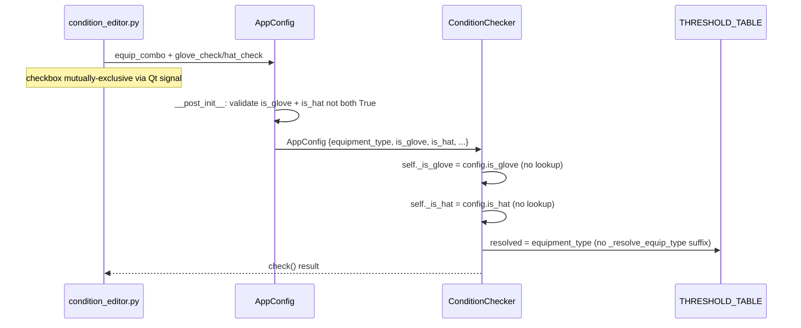

# Tech Spec: 條件規則系統 v3（裝備類型收斂 + 說明文字精簡）

> **Created**: 2026-04-12
> **Last Updated**: 2026-04-13（新增 Phase 2：FR-16..29 文案精準化 + GUI Polish）
> **Requirements**: [1-requirements.md](./1-requirements.md)
> **Predecessor**: [condition-rules-v2 tech-spec](../condition-rules-v2/2-tech-spec.md)
> **Release model**: Full-package redownload（A3）— no migration burden

## Status

| Phase | Scope | Status | Commits |
|-------|-------|--------|---------|
| Phase 1 | 裝備類型收斂 (WS1) + Checkbox UI (WS2) + Summary 初版改寫 (WS3) + 測試更新 (WS4) | ✅ Merged (PR #44, #45, #46) | `4f9e62e`, `0bfa90d`, `1554ddc`, `2c6568e`, `99223a7`, `ef60f49` |
| Phase 2 | FR-16..25 文案精準化（Row catalog 重寫）+ UI label 「帽子→冷卻帽」+ GUI Polish (FR-26..29) | ⏳ Pending | — |

**Phase 2 delta** 為此次 tech-spec 更新新增，詳見 §3.6 Phase 2 Implementation、§5 Work Breakdown（WS5–WS7）、§6.1 FR Traceability（FR-26..29）。

## 1. Requirement Summary

- **Problem**: v2 將手套 / 帽子視為獨立 equipment_type，造成裝備下拉冗長、`is_eternal` 多餘、副手欄位重複、說明冗長
- **Goals**: 裝備類型 6→4 項；checkbox 表達手套 / 帽子子類別；副手單欄位；summary 改社群標記法
- **Scope**: `app/core/condition.py`、`app/gui/condition_editor.py`、`app/models/config.py`、`tests/test_condition.py`
- **Out of scope**: `THRESHOLD_TABLE` 數值 / 絕對附加判定數值 / 自訂模式邏輯 / 萌獸特殊分支

## 2. Existing Code Analysis

### 2.1 Phase 1 已完成（post-merge 現況）

| 模組 | 現況（2026-04-13 實測） |
|------|-----------------------|
| `app/core/condition.py` | `GEAR_EQUIP_TYPES` L462、`EQUIPMENT_ATTRIBUTES` L447、`EQUIPMENT_TYPES` L455、`get_custom_attributes` L492。v2 符號 `GLOVE_TYPES` / `HAT_TYPES` / `ETERNAL_EQUIP_TYPES` / `_resolve_equip_type` 已刪除 |
| `app/core/condition.py` | `ConditionChecker` 以 `self._is_glove = config.is_glove and is_gear` / `self._is_hat = config.is_hat and is_gear` 驅動（L1007-1009）— FR-3 gate 已實作 |
| `app/core/condition.py` | `generate_condition_summary` L753 及 `_generate_*_summary` 已改為 Phase 1 shorthand（99 力 / 77 全 / 12 12 HP / 33 爆 / -1 -1 冷卻）；但文案與 2026-04-13 FR-16..25 **不一致**（詳見 §3.6） |
| `app/gui/condition_editor.py` | `glove_check` L107、`hat_check` L111（label 仍為 `帽子`，需改為 `冷卻帽`）、`_CHECKBOX_TOOLTIP` L34、`_sync_subtype_checks` L396、`_update_subtype_visibility` 引用 `GEAR_EQUIP_TYPES` L415、副手寬度切換 L363-365 |
| `app/models/config.py` | `AppConfig` L37 含 `is_glove` L43 / `is_hat` L44 / `use_gpu` L48；`__post_init__` 互斥歸零 L55-61；`is_eternal` 與 `_OLD_EQUIP_MIGRATION` 已刪除 |
| `app/gui/settings_panel.py` | `gpu_checkbox` L78-85、`config.use_gpu` 讀寫 L92 / L100-102（**待移除**，FR-26） |
| `app/gui/main_window.py` | `btn_check_update` L118（**待加 QSS**，FR-27）；無解析度提示 label（**待新增**，FR-28） |
| `tests/test_condition.py` | `TestConditionCheckerGlove` L1451、`TestConditionCheckerHat` L2126、`TestAbsoluteCubeTwoLines` L2796、`TestGetCustomAttributesSubtype` L1190 — 全部 pass |
| `tests/test_condition_editor.py` | Phase 1 新增（commit `ef60f49`）；GUI polish 對應新測試待補 |

### 2.2 Phase 2 delta target（2026-04-13 新增）

| 目標 | 受影響模組 | Phase 2 工作量 |
|------|------------|-----------------|
| Summary 文案逐字對齊 FR-16..25（精準 string，非近似） | `app/core/condition.py`（summary 區） | ~60 行改寫 + ~30 行測試斷言 |
| UI checkbox label 重新命名 `帽子` → `冷卻帽` | `app/gui/condition_editor.py:111`、`_CHECKBOX_TOOLTIP` 內文 | ~5 行 |
| 移除 GPU 加速 UI + config 讀寫 | `app/gui/settings_panel.py`（L78-85, L92, L100-102） | ~10 行刪除 |
| 更新按鈕 QSS 樣式差異化 | `app/gui/main_window.py`（`btn_check_update`） | ~8 行 QSS |
| 新增解析度提示 label | `app/gui/main_window.py` | ~5 行 |
| 文字統一優化（zh-TW locale、標點、用詞） | 各 GUI 文案 | Sweep |

**Reusable (Phase 1 保留)**:
- `_check_preset_any_pos` / `_check_absolute_append` / `_build_whitelist` 邏輯不動（判定行為不變）
- `THRESHOLD_TABLE` 數值不動（Phase 2 僅改 summary 呈現層）
- `GEAR_EQUIP_TYPES` / `get_custom_attributes` 簽章不動

## 3. Technical Solution

### 3.1 Architecture (affected flow)



### 3.2 Data Model

**AppConfig schema delta**:

```python
@dataclass
class AppConfig:
    cube_type: str = "珍貴附加方塊 (粉紅色)"
    equipment_type: str = "永恆 / 光輝"
    target_attribute: str = "STR"
    # REMOVED: is_eternal: bool = True
    is_glove: bool = False  # NEW: mutually exclusive with is_hat
    is_hat: bool = False    # NEW: mutually exclusive with is_glove
    # ... rest unchanged ...

    def __post_init__(self) -> None:
        if self.is_glove and self.is_hat:
            logger.warning("is_glove and is_hat both True; resetting to False")
            self.is_glove = False
            self.is_hat = False
```

**EQUIPMENT_ATTRIBUTES delta**:

```python
EQUIPMENT_ATTRIBUTES: dict[str, list[str]] = {
    "永恆 / 光輝": ["所有屬性", "STR", "DEX", "INT", "LUK", "全屬性", "MaxHP"],
    "一般裝備 (神秘、漆黑、頂培)": [...同上...],
    "主武器 / 徽章 (米特拉)": ["物理攻擊力", "魔法攻擊力"],
    "輔助武器 (副手)": [_ATTACK_CONVERTIBLE],  # CHANGED: drop phys/magic
    # REMOVED: "手套", "帽子"
    "萌獸": [...unchanged...],
}
```

**Constants to delete**: `GLOVE_TYPES`、`HAT_TYPES`、`ETERNAL_EQUIP_TYPES`、`_resolve_equip_type` (simplified to pass-through or removed; callers use `equipment_type` directly)

**`CUSTOM_SELECTABLE_ATTRIBUTES` / `_EQUIP_TO_CUSTOM_CATEGORY` delta**: 以 English category keys 取代 Chinese keys（滿足 NFR-2：condition.py 中 `"手套"` / `"帽子"` 字串 grep = 0）；新增 `is_glove` / `is_hat` 路徑：

```python
# BEFORE: keys are "裝備"/"手套"/"帽子"/"武器"/"萌獸"
# AFTER: English keys (display text for UI is unaffected — UI reads attribute names, not category keys)
CUSTOM_SELECTABLE_ATTRIBUTES: dict[str, list[str]] = {
    "gear": ["STR", "DEX", "INT", "LUK", "全屬性", "MaxHP"],
    "gear_glove": ["STR", "DEX", "INT", "LUK", "全屬性", "MaxHP", "爆擊傷害"],
    "gear_hat": ["STR", "DEX", "INT", "LUK", "全屬性", "MaxHP", "技能冷卻時間"],
    "weapon": ["物理攻擊力", "魔法攻擊力"],
    "beast": ["最終傷害", "物理攻擊力", "魔法攻擊力", "加持技能持續時間", "被動技能2"],
}

_EQUIP_TO_CUSTOM_CATEGORY: dict[str, str] = {
    "永恆 / 光輝": "gear",
    "一般裝備 (神秘、漆黑、頂培)": "gear",
    "主武器 / 徽章 (米特拉)": "weapon",
    "輔助武器 (副手)": "weapon",
    "萌獸": "beast",
}

def get_custom_attributes(equipment_type: str, is_glove: bool = False, is_hat: bool = False) -> list[str]:
    if is_glove:
        return CUSTOM_SELECTABLE_ATTRIBUTES["gear_glove"]
    if is_hat:
        return CUSTOM_SELECTABLE_ATTRIBUTES["gear_hat"]
    category = _EQUIP_TO_CUSTOM_CATEGORY.get(equipment_type, "gear")
    return CUSTOM_SELECTABLE_ATTRIBUTES[category]
```

**Caller update**: `get_custom_attributes` 目前只有 1 處呼叫（`app/gui/condition_editor.py:177`），在 `_add_custom_row` 內；改寫為 `get_custom_attributes(equip, self.glove_check.isChecked(), self.hat_check.isChecked())`。

### 3.3 API Design

No public API surface change. Internal signatures:

| Function | Before | After |
|----------|--------|-------|
| `get_custom_attributes` | `(equipment_type)` | `(equipment_type, is_glove=False, is_hat=False)` |
| `_resolve_equip_type` | `(equip, is_eternal)` | DELETE (caller uses `equipment_type` directly) |
| `ConditionChecker.__init__` | reads `config.is_eternal` | reads `config.is_glove` / `config.is_hat` |
| `generate_condition_summary` | same signature | rewritten body |

### 3.4 Core Logic

#### 3.4.1 ConditionChecker flag rewiring (FR-3 gated)

```python
# BEFORE (L959-960):
self._is_glove = equip in GLOVE_TYPES
self._is_hat = equip in HAT_TYPES

# AFTER — gated by equipment type to honor FR-3:
GEAR_EQUIP_TYPES = {"永恆 / 光輝", "一般裝備 (神秘、漆黑、頂培)"}
is_gear = equip in GEAR_EQUIP_TYPES
self._is_glove = config.is_glove and is_gear
self._is_hat = config.is_hat and is_gear
```

**Rationale (FR-3)**: 若 `is_glove=True` 但 `equipment_type` 不在 `GEAR_EQUIP_TYPES`（例：誤用 / 手動 config），這兩個 flag 會透過 `_classify_line` (condition.py L579/L582) 讓爆擊 / 冷卻 成為合法 match — 對主武器 / 副手是錯誤語意。UI 層雖保證不會送進此組合（FR-7 checkbox 僅在 gear 顯示），但 core 必須 defence-in-depth 阻擋非法狀態。

**`_resolve_equip_type` removal**: 目前有 **2 處 caller**（condition.py:710 於 `generate_condition_summary`、condition.py:946 於 `ConditionChecker.__init__`）。收斂後 body 退化為 `return equip`，兩處直接 inline 為 `equip` / `config.equipment_type`；函式本身刪除。

#### 3.4.2 Summary rewrite

**Shorthand mapping**:

| Internal | Shorthand (eternal) | Shorthand (normal) |
|----------|---------------------|---------------------|
| STR | 99 力 | 88 力 |
| DEX | 99 敏 | 88 敏 |
| INT | 99 智 | 88 智 |
| LUK | 99 幸 | 88 幸 |
| 全屬性 | 77 全 | 66 全 |
| MaxHP | 12 12 HP | 11 11 HP |
| 爆擊傷害 (glove) | 33 爆 | 33 爆 |
| 技能冷卻時間 (hat) | -1 -1 冷卻 | -1 -1 冷卻 |

**Summary routing (decision tree)** — 實作必須按此順序判斷，與 Signal 5.1..5.8 + FR-16..24 完整對齊：

```
generate_condition_summary(config):
  if not config.use_preset:        → _generate_custom_summary
  if equip == "萌獸" and attr == "雙終被": → special beast beam summary (unchanged)
  if attr == _ATTACK_CONVERTIBLE:   → _generate_sub_weapon_summary (see row S-SW below)
  num_lines = get_num_lines(cube_type)
  is_gear = equip in GEAR_EQUIP_TYPES
  is_glove = config.is_glove and is_gear
  is_hat   = config.is_hat   and is_gear
  is_absolute = (num_lines == 2 and cube_type in _TWO_LINE_CUBE_TYPES)
  
  if is_absolute:
    → _generate_absolute_summary(equip, attr, is_glove, is_hat)    # rows A-*
  else:
    if attr == "所有屬性":
      → _generate_all_attrs_summary(equip, is_glove, is_hat, num_lines)  # rows 3-AS / 3-AS-G / 3-AS-H
    if equip in {"主武器 / 徽章 (米特拉)"}:
      → _generate_weapon_summary(attr)                              # row 3-W
    if is_gear and attr in stats/全屬性/MaxHP:
      → _generate_gear_summary(equip, attr, is_glove, is_hat)       # rows 3-* 
```

**Row catalog** (exhaustive — each row = 1 summary output variant; test fixture = 1 assertion per row):

| Row | Cube | Equip | Target | is_glove | is_hat | Output |
|-----|------|-------|--------|----------|--------|--------|
| 3-ET-S | 珍貴/恢復 | 永恆/光輝 | STR | F | F | `支援 99 力、77 全（3S、雙 S 含全屬混搭）` |
| 3-ET-S-G | 珍貴/恢復 | 永恆/光輝 | STR | T | F | `支援 99 力、77 全、雙爆（3S、雙 S 含全屬混搭）` |
| 3-ET-S-H | 珍貴/恢復 | 永恆/光輝 | STR | F | T | `支援 99 力、77 全、-1 或 -2 冷卻（3S、雙 S 含全屬混搭）` |
| 3-ET-AS | 珍貴/恢復 | 永恆/光輝 | 所有屬性 | F | F | `支援 99 力 / 敏 / 智 / 幸、77 全、12 12 HP（3S、雙 S 含全屬混搭）` |
| 3-ET-AS-G | 珍貴/恢復 | 永恆/光輝 | 所有屬性 | T | F | `支援 99 力 / 敏 / 智 / 幸、77 全、12 12 HP、雙爆（3S、雙 S 含全屬混搭）` |
| 3-ET-AS-H | 珍貴/恢復 | 永恆/光輝 | 所有屬性 | F | T | `支援 99 力 / 敏 / 智 / 幸、77 全、12 12 HP、-1 或 -2 冷卻（3S、雙 S 含全屬混搭）` |
| 3-ET-HP | 珍貴/恢復 | 永恆/光輝 | MaxHP | F | F | `支援 12 12 HP、77 全（3S、雙 S 含全屬混搭）` |
| 3-ET-ALL | 珍貴/恢復 | 永恆/光輝 | 全屬性 | F | F | `支援 77 全（3S、雙 S）` |
| 3-NM-* | 珍貴/恢復 | 一般裝備 | 任意 | varies | varies | 同 3-ET-* 但數值降級：88 力 / 66 全 / 11 11 HP |
| 3-W | 珍貴/恢復 | 主武器/徽章 | 物攻 或 魔攻 | N/A | N/A | `三物 / 魔（3S、雙 S）` |
| 3-SW | 珍貴/恢復 | 副手 | 可轉換 | N/A | N/A | `三物 / 三魔（副手可於遊戲內進行物魔日冕）` |
| A-ET-S | 絕對附加 | 永恆/光輝 | STR | F | F | `99 力；也接受 7 7 全屬（非全屬職業可於遊戲內轉換裝備職業）` |
| A-ET-HP | 絕對附加 | 永恆/光輝 | MaxHP | F | F | `12 12 HP；也接受 7 7 全屬（非全屬職業可於遊戲內轉換裝備職業）` |
| A-ET-ALL | 絕對附加 | 永恆/光輝 | 全屬性 | F | F | `77 全` |
| A-ET-AS | 絕對附加 | 永恆/光輝 | 所有屬性 | F | F | `99 力 / 敏 / 智 / 幸、77 全、12 12 HP` |
| A-ET-AS-G | 絕對附加 | 永恆/光輝 | 所有屬性 | T | F | `99 力 / 敏 / 智 / 幸、77 全、12 12 HP、33 爆` |
| A-ET-AS-H | 絕對附加 | 永恆/光輝 | 所有屬性 | F | T | `99 力 / 敏 / 智 / 幸、77 全、12 12 HP、-1 -1 冷卻` |
| A-NM-* | 絕對附加 | 一般裝備 | 任意 | varies | varies | 同 A-ET-* 但：88 力 / 66 全 / 11 11 HP / 33 爆 / -1 -1 冷卻 |
| A-SW | 絕對附加（2-line） | 副手 | 可轉換 | N/A | N/A | 保留 v2 既有文字：`兩排需同屬性（全物攻 或 全魔攻）...（副手可於遊戲內進行物魔日冕）` |

**Signal mapping（FR → 具體 row）**：

| Signal | Covered rows |
|--------|--------------|
| 5.1（珍貴 + 永恆 + 所有屬性 含 99 力 / 77 全 / 12 12 HP） | 3-ET-AS |
| 5.2（珍貴 + 一般 + STR 含 88 力 / 66 全） | 3-NM-S |
| 5.3（絕對 + 永恆 + STR 含 99 力 + 7 7 全屬） | A-ET-S |
| 5.4（絕對 + 一般 + is_glove 含 33 爆） | A-NM-S-G / A-NM-AS-G |
| 5.5（絕對 + is_hat 含 -1 -1 冷卻） | A-*-H |
| 5.6（珍貴 + 主武器 含 三物 / 魔） | 3-W |
| 5.7（絕對 不含 9 7 雙 S 混搭） | A-ET-S / A-ET-HP（正向斷言 `7 7 全屬`，反向斷言不含 `9 7`） |
| 5.8（副手 3-line 含 三物 / 三魔；2-line 保留日冕） | 3-SW / A-SW |

**New helper functions**:

```python
_STAT_TO_ZH = {"STR": "力", "DEX": "敏", "INT": "智", "LUK": "幸"}

def _fmt_stat_shorthand(stat: str, s_val: int) -> str:
    zh = _STAT_TO_ZH.get(stat, stat)
    return f"{s_val}{s_val} {zh}"  # e.g. "99 力"

def _fmt_all_stats(s_val: int) -> str:
    return f"{s_val}{s_val} 全"  # "77 全"

def _fmt_hp(s_val: int) -> str:
    return f"{s_val} {s_val} HP"  # "12 12 HP"

# crit / cooldown are hardcoded: "33 爆" / "-1 -1 冷卻"
```

**Replace existing**:
- `_generate_all_attrs_summary` → emits shorthand joined list
- `_generate_absolute_summary` / `_generate_absolute_all_attrs_summary` → emits shorthand + optional "（也接受 77 全屬...）" annotation for main-stat / HP targets
- `generate_condition_summary` 3-line branch → switches to shorthand list + trailing modifier like `（3S、雙 S）`

#### 3.4.3 UI checkbox implementation

```python
# Concrete tooltip string (implements FR-10 — shortened from requirement text for UI readability):
_CHECKBOX_TOOLTIP = (
    "勾選後會加入特殊排預檢：\n"
    "• 手套：至少 1 排爆擊傷害 3%（絕對附加須 2 排）\n"
    "• 帽子：至少 1 排冷卻 -1 秒，含 -2（絕對附加須 2 排）\n"
    "若該排不需特殊條件（例：帽子職業不吃冷卻），保持未勾"
)

# In ConditionEditor._init_ui, replace eternal_check block:
self.glove_check = QCheckBox("手套")
self.hat_check = QCheckBox("帽子")
self.glove_check.setToolTip(_CHECKBOX_TOOLTIP)
self.hat_check.setToolTip(_CHECKBOX_TOOLTIP)
self.glove_check.stateChanged.connect(self._on_glove_toggled)
self.hat_check.stateChanged.connect(self._on_hat_toggled)

def _on_glove_toggled(self, state: int) -> None:
    if self.glove_check.isChecked():
        self.hat_check.setChecked(False)
        self.hat_check.setEnabled(False)
    else:
        self.hat_check.setEnabled(True)
    self._update_summary()

def _on_hat_toggled(self, state: int) -> None:
    if self.hat_check.isChecked():
        self.glove_check.setChecked(False)
        self.glove_check.setEnabled(False)
    else:
        self.glove_check.setEnabled(True)
    self._update_summary()

def _update_subtype_visibility(self) -> None:
    is_gear = self.equip_combo.currentText() in {"永恆 / 光輝", "一般裝備 (神秘、漆黑、頂培)"}
    is_preset = self._current_mode() == _MODE_PRESET
    visible = is_gear and is_preset
    self.glove_check.setVisible(visible)
    self.hat_check.setVisible(visible)
```

#### 3.4.4 Sub-weapon field width

```python
def _on_equip_changed(self, equip_type: str) -> None:
    ...
    if equip_type == "輔助武器 (副手)":
        self.attr_combo.setMinimumWidth(260)  # FR-14
    else:
        self.attr_combo.setMinimumWidth(150)
    ...
```

#### 3.4.5 Legacy config safety (Signal 3.3)

```python
@classmethod
def load(cls, path: Path = CONFIG_PATH) -> "AppConfig":
    ...
    equip = data.get("equipment_type", "永恆 / 光輝")
    is_glove = data.get("is_glove", False)
    is_hat = data.get("is_hat", False)
    # Legacy guard: old "手套"/"帽子" strings are no longer valid
    if equip in {"手套", "帽子"}:
        logger.warning("Legacy equipment_type '%s' fallback to default", equip)
        equip = "永恆 / 光輝"
        is_glove = is_hat = False
    # Remove is_eternal from data (ignored)
    data.pop("is_eternal", None)
    ...
```

### 3.6 Phase 2 Implementation (2026-04-13)

#### 3.6.1 Summary 文案逐字對齊（FR-16..25）

Phase 1 row catalog 提供結構性描述（如 `支援 99 力 / 敏 / 智 / 幸、77 全、12 12 HP（3S、雙 S 含全屬混搭）`）；Phase 2 改為「結構性簡述」優先，數值僅在絕對附加情境出現。下表**取代** §3.4.2 row catalog（Phase 1 版本作廢，但保留 internal helper / shorthand mapping）。

**新 Row catalog（FR-16..25 逐字 string，per Signal 5.x / 6.x）**：

| Row | Cube | Equip | Target | is_glove | is_hat | Output（逐字） |
|-----|------|-------|--------|----------|--------|--------|
| 3-G-AS | 珍貴/恢復 | 永恆/光輝 OR 一般裝備 | 所有屬性 | F | F | `支援 力 / 敏 / 智 / 幸、全屬、HP，包含 3S、雙 S 及全屬混搭` |
| 3-G-S4 | 珍貴/恢復 | 永恆/光輝 OR 一般裝備 | STR/DEX/INT/LUK | F | F | `支援 3S、雙 S，包含全屬混搭` |
| 3-G-ALL | 珍貴/恢復 | 永恆/光輝 OR 一般裝備 | 全屬性 | F | F | `包含 3S、雙 S 的情況` |
| 3-G-HP | 珍貴/恢復 | 永恆/光輝 OR 一般裝備 | MaxHP | F | F | `支援 HP、全屬，包含 3S、雙 S 及全屬混搭`（採與 3-G-AS 同句型；數值省略以維持 FR-16..18 「不列裝備等級數值」原則） |
| 3-G-GLOVE | 珍貴/恢復 | 永恆/光輝 OR 一般裝備 | any | T | F | `必須符合一排為爆擊傷害 3%，支援雙爆、3S、雙 S` |
| 3-G-HAT | 珍貴/恢復 | 永恆/光輝 OR 一般裝備 | any | F | T | `必須符合一排為技能冷卻時間 -1 秒，支援 -2 冷卻、3S、雙 S` |
| 3-W-PHYS | 珍貴/恢復 | 主武器/徽章 | 物理攻擊力 | N/A | N/A | `三物（支援 3S、雙 S）` |
| 3-W-MAG | 珍貴/恢復 | 主武器/徽章 | 魔法攻擊力 | N/A | N/A | `三魔（支援 3S、雙 S）` |
| 3-SW | 珍貴/恢復 | 副手 | 可轉換 | N/A | N/A | 維持 Phase 1：`三物 / 三魔（副手可於遊戲內進行物魔日冕）` |
| A-S4 | 絕對附加 | 永恆/光輝 | STR | F | F | `99 力`（其他主屬替換，無括號、無補充字樣） |
| A-S4-NM | 絕對附加 | 一般裝備 | STR | F | F | `88 力`（其他主屬替換） |
| A-HP | 絕對附加 | 永恆/光輝 | MaxHP | F | F | `12 12 HP` |
| A-HP-NM | 絕對附加 | 一般裝備 | MaxHP | F | F | `11 11 HP` |
| A-AS | 絕對附加 | 永恆/光輝 | 所有屬性 | F | F | `僅支援 99 四屬、77全、12 12 HP`（注意 `77全` 無空格） |
| A-AS-NM | 絕對附加 | 一般裝備 | 所有屬性 | F | F | `僅支援 88 四屬、66全、11 11 HP` |
| A-GLOVE | 絕對附加 | gear | any | T | F | `僅支援 33 爆` |
| A-HAT | 絕對附加 | gear | any | F | T | `支援 -1 -1 冷卻，也接受 77 全 冷卻；若洗到主屬會直接洗掉` |
| A-SW | 絕對附加 | 副手 | 可轉換 | N/A | N/A | 維持 Phase 1（保留 `(副手可於遊戲內進行物魔日冕)` 結尾） |

**全屬性（target = "全屬性"）絕對附加** 的處理（FR-22 範圍邊界）：
- 永恆/光輝：採用 row A-AS（「僅支援 99 四屬、77全、12 12 HP」） — 因 target=全屬性 已隱含 77 全主軸
- 一般裝備：對應 A-AS-NM
- 若 implementation 偏好分離（target=全屬性 vs target=所有屬性），可拆 Row A-ALL = `77全`；否則沿用 A-AS
- **OQ-6 reference**：FR-22 文案是否要在 target=全屬性 時退化為單列 `77全`？預設：沿用 A-AS（與 target=所有屬性 一致）以降低測試斷言維度（OQ-6 詳見 §7）

**Implementation pattern**：

```python
# app/core/condition.py — Phase 2 summary rewrite
# 字串必須與 §3.6.1 row catalog 逐字一致（含全形標點 `，` `、` `；`，避免 FR-29 違規與 Signal 5.x/6.x 斷言失敗）
_PHASE2_PRESET_TEMPLATES = {
    ("3line", "all_attrs"):        "支援 力 / 敏 / 智 / 幸、全屬、HP，包含 3S、雙 S 及全屬混搭",
    ("3line", "main_stat"):        "支援 3S、雙 S，包含全屬混搭",
    ("3line", "all_stats"):        "包含 3S、雙 S 的情況",   # target=全屬性
    ("3line", "glove"):            "必須符合一排為爆擊傷害 3%，支援雙爆、3S、雙 S",
    ("3line", "hat"):              "必須符合一排為技能冷卻時間 -1 秒，支援 -2 冷卻、3S、雙 S",
    ("3line", "weapon_phys"):      "三物（支援 3S、雙 S）",
    ("3line", "weapon_mag"):       "三魔（支援 3S、雙 S）",
    ("absolute", "glove"):         "僅支援 33 爆",
    ("absolute", "hat"):           "支援 -1 -1 冷卻，也接受 77 全 冷卻；若洗到主屬會直接洗掉",
}
# 主屬 / HP / 全屬 routing 仍走原 helper（_fmt_stat_shorthand etc.）
# 絕對附加 target=所有屬性 的「僅支援」字串組合於 _generate_absolute_all_attrs_summary 內 build：
#   parts = ["99 四屬", "77全", "12 12 HP"]  (eternal) / ["88 四屬", "66全", "11 11 HP"] (normal)
#   return "僅支援 " + "、".join(parts)
```

**Decision precedence**（is_glove / is_hat 覆蓋 target 的優先順序）：

```
if is_glove → row 3-G-GLOVE / A-GLOVE   (覆蓋 target 文案)
elif is_hat → row 3-G-HAT / A-HAT       (覆蓋 target 文案)
elif equip == 主武器/徽章 → row 3-W-*
elif equip == 副手 → row 3-SW / A-SW
elif target == 所有屬性 → row 3-G-AS / A-AS
elif target == 全屬性 → row 3-G-ALL / A-AS（共用，OQ-6）
elif target == MaxHP → row 3-G-HP / A-HP
else (主屬) → row 3-G-S4 / A-S4
```

#### 3.6.2 UI label rename (FR-7)

```python
# app/gui/condition_editor.py:111 — single-line change
self.hat_check = QCheckBox("冷卻帽")  # was: QCheckBox("帽子")

# Update _CHECKBOX_TOOLTIP (L34) to use 冷卻帽 in user-visible strings:
_CHECKBOX_TOOLTIP = (
    "勾選後會加入特殊排預檢：\n"
    "• 手套：至少 1 排爆擊傷害 3%（絕對附加須 2 排）\n"
    "• 冷卻帽：至少 1 排冷卻 -1 秒，含 -2（絕對附加須 2 排）\n"
    "若三排同屬（無爆/冷）會判定為不合格；若該排不需特殊條件（例：要洗主屬帽子），保持未勾"
)
```

**Internal `is_hat` flag 不變** — Signal 7.4 以 `hat_check.text() == "冷卻帽"` widget 斷言驗證。

#### 3.6.3 GPU 區塊移除 (FR-26)

```python
# app/gui/settings_panel.py — delete L78-85 (gpu_checkbox 區塊) entirely:
# (BEFORE)
# row4 = QHBoxLayout()
# self.gpu_checkbox = QCheckBox("啟用 GPU 加速（需要 NVIDIA 顯卡 + CUDA）")
# self.gpu_checkbox.setEnabled(False)
# self.gpu_checkbox.setToolTip("目前已停用此選項")
# row4.addWidget(self.gpu_checkbox)
# row4.addStretch()
# layout.addLayout(row4)

# (AFTER) — block deleted entirely

# Also delete:
# - L92: config.use_gpu = self.gpu_checkbox.isChecked()
# - L100-102: load_persistent_from_config method body referring to gpu_checkbox
#   (若 method 整體只剩這兩行，可整 method 刪除；caller `main_window.py` 需配合移除呼叫)
```

**`AppConfig.use_gpu` 欄位保留**（per A7）— 避免 OCR 引擎引用點破壞；僅斷尾 UI。新測試 Signal 7.1.b：`grep -n "use_gpu" app/gui/settings_panel.py` 結果為 0。

#### 3.6.4 更新按鈕 QSS (FR-27)

```python
# app/gui/main_window.py 在 L118 後新增：
self.btn_check_update.setStyleSheet("""
    QPushButton {
        background-color: #2196F3;
        color: white;
        border: 1px solid #1976D2;
        border-radius: 4px;
        padding: 4px 12px;
    }
    QPushButton:hover {
        background-color: #1976D2;
    }
    QPushButton:pressed {
        background-color: #0D47A1;
    }
""")
self.btn_check_update.setFlat(False)  # 確保非 flat（Signal 7.2 機械斷言）
```

**色彩選擇 rationale**（OQ-2 預設方案）：採 Material Blue 500 系列，與 `btn_start` ▶ 開始按鈕（綠色）視覺權重相當，但色相不衝突；確保 `styleSheet() != ""` 與 `isFlat() == False`。

#### 3.6.5 解析度提示 label (FR-28)

```python
# app/gui/main_window.py 主視窗 layout 中加入：
self.resolution_hint = QLabel("建議採用解析度 1920 x 1080 辨識上會比較精準")
self.resolution_hint.setStyleSheet("color: gray; font-size: 12px;")
# 位置建議：靠近設定面板上方或狀態列下方；layout.addWidget(self.resolution_hint) 加在合適 row
```

樣式對照 `app/gui/settings_panel.py:67-68` 既有 `delay_hint` 模式（gray、12px）。

#### 3.6.6 文字統一優化 (FR-29)

Sweep 範圍 + 規則：

| 區域 | 規則 |
|------|------|
| Tooltip / label / summary | 採台灣繁中慣用詞（`資料` 非 `数据`、`程式` 非 `程序`、`解析度` 非 `分辨率`） |
| 標點 | 統一全形中文標點（`，` `、` `。` `（）`），但 ASCII 程式碼 / 數字保留半形 |
| 技術術語 | 保留英文（OCR、GPU、HP、QSS、API）|
| 一致性 | 同義異名統一：`手套` 全為 checkbox label / `冷卻帽` 取代所有 user-visible `帽子` |

Sweep 工具：`grep -n "数据\|程序\|分辨率\|帽子" app/gui/*.py` 應為 0（除註解 / docstring）。

## 4. Risks and Dependencies

### 4.1 Phase 1 Risks（已消化，僅供追溯）

| # | Risk | Mitigation | Status |
|---|------|-----------|--------|
| R1 | Summary 改寫誤差 — shorthand 數值與 THRESHOLD_TABLE 不一致 | NFR-6 測試：summary 生成分支對照 `THRESHOLD_TABLE` 數值斷言 | ✅ Phase 1 done（Phase 2 將再次驗證） |
| R2 | Checkbox 互斥邏輯在 load_from_config 時未觸發 Qt signal → UI 狀態錯亂 | `_sync_subtype_checks` 以 `blockSignals` 包覆 | ✅ Phase 1 done |
| R3 | 自訂模式 `get_custom_attributes` 新簽章影響多處呼叫 | 一次改完 + 測試覆蓋 | ✅ Phase 1 done |
| R4 | `is_eternal` 欄位刪除後舊測試 TypeError | Grep + 批量改寫 | ✅ Phase 1 done |
| R5 | `_resolve_equip_type` 移除後 KeyError | WS1 sweep | ✅ Phase 1 done |
| R6 | 萌獸分支不受影響 | Non-scope | ✅ |

### 4.2 Phase 2 Risks（新增）

| # | Risk | Mitigation |
|---|------|-----------|
| R7 | Summary 文案精準化後與 Phase 1 測試斷言衝突（既有 `TestSummaryShorthand` 測試會 fail） | Phase 2 先改測試斷言再改實作；commit 順序：測試失敗 → 實作 → 測試通過 |
| R8 | FR-22 target=全屬性 vs target=所有屬性 的絕對附加輸出行為未在 1-requirements.md 完全定案（OQ-6） | 採 `A-AS` 沿用方案；若使用者驗收時反饋需拆分，再行 follow-up ticket |
| R9 | `settings_panel.py` 移除 `gpu_checkbox` 後，`main_window.py` 或其他 caller 若有 `load_persistent_from_config` 呼叫（傳入 gpu 狀態）會 AttributeError | Grep `load_persistent_from_config` 全專案 call site；若整 method 無其他用途則整體刪除 |
| R10 | `btn_check_update` QSS 套用後於不同 OS（Win / macOS）渲染差異（hover、border） | 保持標準 Qt widget stylesheet；不用 platform-specific pseudo-state |
| R11 | `hat_check` label 改 `冷卻帽` 後，既有 GUI 測試（`tests/test_condition_editor.py`）若斷言 `text() == "帽子"` 會失敗 | 測試先改斷言（widget text assertion per Signal 7.4） |
| R12 | FR-29 文字 sweep 可能觸及非意圖文字（例：程式碼內 docstring 含簡中詞彙不應改） | Sweep 限定 user-visible string（QLabel / QCheckBox / setToolTip）；註解 / docstring 保持不動 |

**Dependencies**: 僅 Python stdlib + PyQt6；無外部套件新增

## 5. Work Breakdown

| WS | Scope | Files | 預估改動量 |
|----|-------|-------|-----------|
| **WS1** | 裝備類型收斂 + ConditionChecker 改線 | `app/core/condition.py`、`app/models/config.py` | ~80 行：刪 `GLOVE_TYPES`/`HAT_TYPES`/`ETERNAL_EQUIP_TYPES`/`_resolve_equip_type`；改 `ConditionChecker.__init__`；改 `AppConfig` schema + `__post_init__` + `load()` 防呆 |
| **WS2** | Checkbox UI + 副手欄位寬度 | `app/gui/condition_editor.py` | ~120 行：替換 `eternal_check` 為 `glove_check` + `hat_check`；mutually exclusive handler；`_update_subtype_visibility`；sub-weapon 寬度條件；`load_from_config` 同步更新 |
| **WS3** | Summary 全面改寫 | `app/core/condition.py` (summary 區) | ~150 行：新 helper（`_fmt_stat_shorthand`、`_STAT_TO_ZH` 等）；改寫四個 `_generate_*_summary` 函式 |
| **WS4** | 測試更新 | `tests/test_condition.py` | ~30 處 constructor 改寫 + 新增 Signal 3.3/3.4 測試（~40 行）+ 新增 FR-16..24 summary 斷言（~60 行） |

**Phase 1 commit order**（已完成）: WS1 → WS4（測試先綠）→ WS2 → WS3。

### 5.1 Phase 2 Work Breakdown（新增）

| WS | Scope | Files | 預估改動量 |
|----|-------|-------|-----------|
| **WS5** | Summary 文案精準化（FR-16..25 逐字對齊）+ UI label `帽子→冷卻帽` (FR-7) | `app/core/condition.py`（summary 區）、`app/gui/condition_editor.py:111` 與 `_CHECKBOX_TOOLTIP` | ~70 行：Phase 2 row catalog 模板替換 + 1 行 widget label + tooltip 內文 |
| **WS6** | GPU 區塊移除 (FR-26) | `app/gui/settings_panel.py`（L78-85, L92, L100-102） | ~10 行刪除（含 `load_persistent_from_config` caller sweep） |
| **WS7** | 主視窗 GUI Polish (FR-27 + FR-28 + FR-29) | `app/gui/main_window.py`（btn_check_update QSS + resolution_hint label）、各 GUI 文案 sweep | ~20 行新增 + 文案 sweep |
| **WS8** | Phase 2 測試 | `tests/test_condition.py` (summary 斷言 update)、`tests/test_condition_editor.py` (Signal 7.4 label 斷言 update)、擴充既有 `tests/test_main_window.py` (Signal 7.1.a / 7.1.b / 7.2 / 7.3) | ~80 行 |

**Phase 2 commit order**: WS8（測試斷言先改成新預期）→ WS5（summary 改寫使測試通過）→ WS6 → WS7。

**Recommended Phase 2 request tickets**（每張獨立 AC，可並行）:
1. `2026-04-13-summary-precision-r4.md` — WS5 + WS8a（summary + label）
2. `2026-04-13-gpu-removal-r5.md` — WS6 + WS8b
3. `2026-04-13-main-window-polish-r6.md` — WS7 + WS8c

## 6. Testing Strategy

| Layer | Scope | Coverage |
|-------|-------|----------|
| **Unit (ConditionChecker)** | 既有 `TestConditionCheckerGlove`/`Hat`/`SubWeaponConvertible`/`AbsoluteCubeTwoLines` | 全部改用新 schema；行為斷言等價 v2（Signal 2.2 / 2.4） |
| **Unit (AppConfig)** | 新增 `TestAppConfigValidation` | `__post_init__` 互斥驗證（Signal 3.4）；legacy equipment_type 防呆（Signal 3.3）；`is_eternal` 欄位不存在於 schema（Signal 3.1） |
| **Unit (Summary)** | 新增 `TestSummaryShorthand` | FR-16..24 字串斷言：覆蓋 Signal 5.1..5.8 共 8 個 sample |
| **Unit (ConditionChecker subtype gating)** | 新增 `TestSubTypeGating` | `equipment_type="永恆 / 光輝"` + `is_glove=True` 與 v2 `equipment_type="手套"` + `is_eternal=True` 判定結果等價 |
| **Integration** | `ConditionEditor` 檢查器（手動） | 手動 UI 驗證：checkbox 互斥、副手寬度、summary 顯示（NFR-4、NFR-5） |
| **Unit (Summary Phase 2)** | 既有 `TestSummaryShorthand` 斷言更新 | Phase 2 row catalog 逐字 string 斷言（Signal 5.1..5.8 + Signal 6.1..6.7） |
| **Unit/GUI (UI label)** | 既有 `tests/test_condition_editor.py` | `assert hat_check.text() == "冷卻帽"` (Signal 7.4) |
| **Unit/GUI (settings panel)** | 併入 `tests/test_main_window.py`（無獨立 `test_settings_panel.py`，避免新增分散） | 載入 `SettingsPanel`，斷言 `getattr(panel, "gpu_checkbox", None) is None` (Signal 7.1.a)；無 `use_gpu` 讀寫（Signal 7.1.b） |
| **Unit/GUI (main window)** | 擴充既有 `tests/test_main_window.py` | `btn_check_update.styleSheet() != ""` AND `isFlat() == False` (Signal 7.2)；`resolution_hint.text()` 含 `1920` AND `1080` (Signal 7.3) |
| **Sweep test** | 新增 `tests/test_locale_sweep.py` | `grep -RE "数据\|程序\|分辨率"` 在 `app/gui/*.py` 結果為 0（FR-29） |

**Regression baseline**: Phase 2 開工前 `uv run pytest` 全綠（含 Phase 1 已有測試）；WS5-8 完成後重跑須全綠且新增測試也綠

**Test data fixtures**:
```python
# New fixtures in tests/conftest.py or inline
@pytest.fixture
def eternal_glove_config():
    return AppConfig(
        equipment_type="永恆 / 光輝",
        target_attribute="STR",
        is_glove=True,
        is_hat=False,
    )

@pytest.fixture
def normal_hat_config():
    return AppConfig(
        equipment_type="一般裝備 (神秘、漆黑、頂培)",
        target_attribute="STR",
        is_glove=False,
        is_hat=True,
    )
```

## 6.1 FR → Spec traceability

| FR | Spec section | Test |
|----|--------------|------|
| FR-1 equipment types 6→4 | §3.2 EQUIPMENT_ATTRIBUTES delta | TestConditionChecker* 改 schema 後全綠 |
| FR-2 `is_glove`/`is_hat` fields | §3.2 AppConfig schema | TestAppConfigValidation Signal 3.4 |
| FR-3 flags only meaningful on gear | §3.4.1 gated flag rewiring | TestSubTypeGating：非 gear + is_glove=True ignored |
| FR-4 `accept_crit3`/`accept_cooldown` from config | §3.4.1 | existing TestConditionCheckerGlove/Hat 改 schema |
| FR-5 `_resolve_equip_type` deletion | §3.4.1 + Caller update | 覆蓋於既有 checker 測試 |
| FR-6 remove `is_eternal` field | §3.2 schema # REMOVED | TestAppConfigValidation Signal 3.1 |
| FR-7..10 checkbox + tooltip | §3.4.3 | 手動 UI 驗證（Signal 2.1） |
| FR-11 legacy fallback | §3.4.5 | TestAppConfigValidation Signal 3.3 |
| FR-12 cleanup `_OLD_EQUIP_MIGRATION` | §2 delta | grep-based acceptance |
| FR-13..15 副手 single attr + width | §3.2 + §3.4.4 | 手動 UI（Signal 4.1..4.3） |
| FR-16..21.2 summary shorthand (Phase 2 文案) | §3.6.1 row catalog（取代 §3.4.2 Phase 1 catalog） | TestSummaryShorthand Phase 2 update：Signal 5.1..5.8 逐字斷言 |
| FR-22..25 絕對附加 summary (Phase 2 文案) | §3.6.1 A-* rows | Signal 6.1..6.7 逐字斷言 |
| FR-7 UI label `冷卻帽` | §3.6.2 | Signal 7.4 widget text 斷言 |
| FR-26 GPU UI + config 讀寫移除 | §3.6.3 | Signal 7.1.a / 7.1.b grep + GUI 測試 |
| FR-27 更新按鈕可辨識 | §3.6.4 | Signal 7.2 機械斷言 (`styleSheet() != ""` AND `isFlat() == False`) |
| FR-28 解析度提示 | §3.6.5 | Signal 7.3 widget findText 斷言 |
| FR-29 文字統一 | §3.6.6 | Sweep grep + manual review |

## 7. Open Questions

| # | Question | Proposed default |
|---|----------|------------------|
| OQ-1 | Checkbox tooltip 實際文字（FR-10 描述較長，螢幕閱讀性待確認） | 採用 FR-10 條列式但略縮短；實作後以 UI 目視驗證調整 |
| OQ-2 | `_resolve_equip_type` 要完全移除還是保留為 pass-through？ | **完全移除** — 無後綴合併後其 body 會退化為 `return equip`，無存在必要；影響 call site ~3 處直接 inline |
| OQ-3 | `is_glove` / `is_hat` 是否要在 `__post_init__` 中驗證「僅限永恆/光輝與一般裝備」（例：`is_glove=True` + `equipment_type="主武器 / 徽章"` 是 invalid state）？ | **不驗證** — 由 UI 層保證不會送進這種組合（FR-3 決定其他裝備類型「忽略」兩個 flag，不需 raise）；自訂 config 手改若出現這狀況，`accept_crit3` 被設為 True 但不傷害（不影響主武器判定邏輯） |
| OQ-4 | Summary 新格式的「（3S、雙 S）」等修飾文字要不要列為 localisable constant？ | **內嵌字串** — 個人自用工具、單一 locale（繁中）、無 i18n 需求 |
| OQ-5（Phase 2）| `btn_check_update` 的 QSS 配色（對應 1-requirements.md OQ-2）| **預設方案：Material Blue 500 系列**（`#2196F3`，hover `#1976D2`，pressed `#0D47A1`），與 `btn_start` 視覺權重對等但色相不衝突；實作後可依使用者反饋微調 |
| OQ-6（Phase 2）| 絕對附加 target=全屬性 與 target=所有屬性 的輸出是否需區分？ | **預設沿用 row A-AS**（`僅支援 99 四屬、77全、12 12 HP`）；若使用者於驗收階段反饋 target=全屬性 應為單列 `77全`，再以 follow-up ticket 處理 |
| OQ-7（Phase 2）| 解析度提示 label 在主視窗的精確位置 | **預設：靠近狀態列下方** 或設定面板上方（layout 內第一個 row）；實作後以 UI 目視驗證調整 |

**Non-blocking for implementation**：所有 OQ 皆可在實作過程中以預設方案推進，人工驗證後微調。
