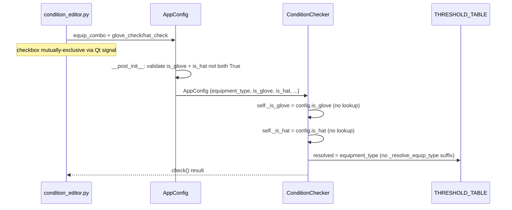

# Tech Spec: 條件規則系統 v3（裝備類型收斂 + 說明文字精簡）

> **Created**: 2026-04-12
> **Requirements**: [1-requirements.md](./1-requirements.md)
> **Predecessor**: [condition-rules-v2 tech-spec](../condition-rules-v2/2-tech-spec.md)
> **Release model**: Full-package redownload（A3）— no migration burden

## 1. Requirement Summary

- **Problem**: v2 將手套 / 帽子視為獨立 equipment_type，造成裝備下拉冗長、`is_eternal` 多餘、副手欄位重複、說明冗長
- **Goals**: 裝備類型 6→4 項；checkbox 表達手套 / 帽子子類別；副手單欄位；summary 改社群標記法
- **Scope**: `app/core/condition.py`、`app/gui/condition_editor.py`、`app/models/config.py`、`tests/test_condition.py`
- **Out of scope**: `THRESHOLD_TABLE` 數值 / 絕對附加判定數值 / 自訂模式邏輯 / 萌獸特殊分支

## 2. Existing Code Analysis

| 模組 | 關鍵符號 | 變更類型 |
|------|----------|----------|
| `app/core/condition.py` | `EQUIPMENT_ATTRIBUTES`、`EQUIPMENT_TYPES`、`GLOVE_TYPES`、`HAT_TYPES`、`ETERNAL_EQUIP_TYPES`、`_resolve_equip_type`、`_EQUIP_TO_CUSTOM_CATEGORY` | 收斂 / 刪除 |
| `app/core/condition.py` | `ConditionChecker.__init__`（L959-960 glove/hat 旗標）、`_check_preset_any_pos` dispatch | 改由 `config.is_glove` / `config.is_hat` 驅動 |
| `app/core/condition.py` | `generate_condition_summary`、`_generate_absolute_summary`、`_generate_absolute_all_attrs_summary`、`_generate_all_attrs_summary` | 全面改寫輸出格式 |
| `app/gui/condition_editor.py` | `eternal_check` (L95-98)、`_update_eternal_visibility` (L350-354)、`attr_combo` 寬度 (L123) | 換成 `glove_check`/`hat_check`；寬度依 equip 條件擴展 |
| `app/models/config.py` | `AppConfig.is_eternal` (L43)、`_OLD_EQUIP_MIGRATION` (L83-91) | 刪除 `is_eternal`；新增 `is_glove`/`is_hat`；清理 legacy 項目 |
| `tests/test_condition.py` | `TestConditionCheckerGlove` (L1390)、`TestConditionCheckerHat` (L2015)、`TestAbsoluteCubeTwoLines` (L2467) | Config 構造改新 schema；行為斷言保留 |

**Reusable**: 
- `_check_preset_any_pos` / `_check_absolute_append` / `_build_whitelist` 邏輯完整保留（只換輸入來源）
- `THRESHOLD_TABLE` 永恆 / 一般 key 原樣使用（已驗證 `手套 (永恆)` ≡ `永恆 / 光輝` 數值）

## 3. Technical Solution

### 3.1 Architecture (affected flow)



### 3.2 Data Model

**AppConfig schema delta**:

```python
@dataclass
class AppConfig:
    cube_type: str = "珍貴附加方塊 (粉紅色)"
    equipment_type: str = "永恆 / 光輝"
    target_attribute: str = "STR"
    # REMOVED: is_eternal: bool = True
    is_glove: bool = False  # NEW: mutually exclusive with is_hat
    is_hat: bool = False    # NEW: mutually exclusive with is_glove
    # ... rest unchanged ...

    def __post_init__(self) -> None:
        if self.is_glove and self.is_hat:
            logger.warning("is_glove and is_hat both True; resetting to False")
            self.is_glove = False
            self.is_hat = False
```

**EQUIPMENT_ATTRIBUTES delta**:

```python
EQUIPMENT_ATTRIBUTES: dict[str, list[str]] = {
    "永恆 / 光輝": ["所有屬性", "STR", "DEX", "INT", "LUK", "全屬性", "MaxHP"],
    "一般裝備 (神秘、漆黑、頂培)": [...同上...],
    "主武器 / 徽章 (米特拉)": ["物理攻擊力", "魔法攻擊力"],
    "輔助武器 (副手)": [_ATTACK_CONVERTIBLE],  # CHANGED: drop phys/magic
    # REMOVED: "手套", "帽子"
    "萌獸": [...unchanged...],
}
```

**Constants to delete**: `GLOVE_TYPES`、`HAT_TYPES`、`ETERNAL_EQUIP_TYPES`、`_resolve_equip_type` (simplified to pass-through or removed; callers use `equipment_type` directly)

**`CUSTOM_SELECTABLE_ATTRIBUTES` / `_EQUIP_TO_CUSTOM_CATEGORY` delta**: 以 English category keys 取代 Chinese keys（滿足 NFR-2：condition.py 中 `"手套"` / `"帽子"` 字串 grep = 0）；新增 `is_glove` / `is_hat` 路徑：

```python
# BEFORE: keys are "裝備"/"手套"/"帽子"/"武器"/"萌獸"
# AFTER: English keys (display text for UI is unaffected — UI reads attribute names, not category keys)
CUSTOM_SELECTABLE_ATTRIBUTES: dict[str, list[str]] = {
    "gear": ["STR", "DEX", "INT", "LUK", "全屬性", "MaxHP"],
    "gear_glove": ["STR", "DEX", "INT", "LUK", "全屬性", "MaxHP", "爆擊傷害"],
    "gear_hat": ["STR", "DEX", "INT", "LUK", "全屬性", "MaxHP", "技能冷卻時間"],
    "weapon": ["物理攻擊力", "魔法攻擊力"],
    "beast": ["最終傷害", "物理攻擊力", "魔法攻擊力", "加持技能持續時間", "被動技能2"],
}

_EQUIP_TO_CUSTOM_CATEGORY: dict[str, str] = {
    "永恆 / 光輝": "gear",
    "一般裝備 (神秘、漆黑、頂培)": "gear",
    "主武器 / 徽章 (米特拉)": "weapon",
    "輔助武器 (副手)": "weapon",
    "萌獸": "beast",
}

def get_custom_attributes(equipment_type: str, is_glove: bool = False, is_hat: bool = False) -> list[str]:
    if is_glove:
        return CUSTOM_SELECTABLE_ATTRIBUTES["gear_glove"]
    if is_hat:
        return CUSTOM_SELECTABLE_ATTRIBUTES["gear_hat"]
    category = _EQUIP_TO_CUSTOM_CATEGORY.get(equipment_type, "gear")
    return CUSTOM_SELECTABLE_ATTRIBUTES[category]
```

**Caller update**: `get_custom_attributes` 目前只有 1 處呼叫（`app/gui/condition_editor.py:177`），在 `_add_custom_row` 內；改寫為 `get_custom_attributes(equip, self.glove_check.isChecked(), self.hat_check.isChecked())`。

### 3.3 API Design

No public API surface change. Internal signatures:

| Function | Before | After |
|----------|--------|-------|
| `get_custom_attributes` | `(equipment_type)` | `(equipment_type, is_glove=False, is_hat=False)` |
| `_resolve_equip_type` | `(equip, is_eternal)` | DELETE (caller uses `equipment_type` directly) |
| `ConditionChecker.__init__` | reads `config.is_eternal` | reads `config.is_glove` / `config.is_hat` |
| `generate_condition_summary` | same signature | rewritten body |

### 3.4 Core Logic

#### 3.4.1 ConditionChecker flag rewiring (FR-3 gated)

```python
# BEFORE (L959-960):
self._is_glove = equip in GLOVE_TYPES
self._is_hat = equip in HAT_TYPES

# AFTER — gated by equipment type to honor FR-3:
_GEAR_EQUIP = {"永恆 / 光輝", "一般裝備 (神秘、漆黑、頂培)"}
is_gear = equip in _GEAR_EQUIP
self._is_glove = config.is_glove and is_gear
self._is_hat = config.is_hat and is_gear
```

**Rationale (FR-3)**: 若 `is_glove=True` 但 `equipment_type` 不在 `_GEAR_EQUIP`（例：誤用 / 手動 config），這兩個 flag 會透過 `_classify_line` (condition.py L579/L582) 讓爆擊 / 冷卻 成為合法 match — 對主武器 / 副手是錯誤語意。UI 層雖保證不會送進此組合（FR-7 checkbox 僅在 gear 顯示），但 core 必須 defence-in-depth 阻擋非法狀態。

**`_resolve_equip_type` removal**: 目前有 **2 處 caller**（condition.py:710 於 `generate_condition_summary`、condition.py:946 於 `ConditionChecker.__init__`）。收斂後 body 退化為 `return equip`，兩處直接 inline 為 `equip` / `config.equipment_type`；函式本身刪除。

#### 3.4.2 Summary rewrite

**Shorthand mapping**:

| Internal | Shorthand (eternal) | Shorthand (normal) |
|----------|---------------------|---------------------|
| STR | 99 力 | 88 力 |
| DEX | 99 敏 | 88 敏 |
| INT | 99 智 | 88 智 |
| LUK | 99 幸 | 88 幸 |
| 全屬性 | 77 全 | 66 全 |
| MaxHP | 12 12 HP | 11 11 HP |
| 爆擊傷害 (glove) | 33 爆 | 33 爆 |
| 技能冷卻時間 (hat) | -1 -1 冷卻 | -1 -1 冷卻 |

**Summary routing (decision tree)** — 實作必須按此順序判斷，與 Signal 5.1..5.8 + FR-16..24 完整對齊：

```
generate_condition_summary(config):
  if not config.use_preset:        → _generate_custom_summary
  if equip == "萌獸" and attr == "雙終被": → special beast beam summary (unchanged)
  if attr == _ATTACK_CONVERTIBLE:   → _generate_sub_weapon_summary (see row S-SW below)
  num_lines = get_num_lines(cube_type)
  is_gear = equip in _GEAR_EQUIP
  is_glove = config.is_glove and is_gear
  is_hat   = config.is_hat   and is_gear
  is_absolute = (num_lines == 2 and cube_type in _TWO_LINE_CUBE_TYPES)
  
  if is_absolute:
    → _generate_absolute_summary(equip, attr, is_glove, is_hat)    # rows A-*
  else:
    if attr == "所有屬性":
      → _generate_all_attrs_summary(equip, is_glove, is_hat, num_lines)  # rows 3-AS / 3-AS-G / 3-AS-H
    if equip in {"主武器 / 徽章 (米特拉)"}:
      → _generate_weapon_summary(attr)                              # row 3-W
    if is_gear and attr in stats/全屬性/MaxHP:
      → _generate_gear_summary(equip, attr, is_glove, is_hat)       # rows 3-* 
```

**Row catalog** (exhaustive — each row = 1 summary output variant; test fixture = 1 assertion per row):

| Row | Cube | Equip | Target | is_glove | is_hat | Output |
|-----|------|-------|--------|----------|--------|--------|
| 3-ET-S | 珍貴/恢復 | 永恆/光輝 | STR | F | F | `支援 99 力、77 全（3S、雙 S 含全屬混搭）` |
| 3-ET-S-G | 珍貴/恢復 | 永恆/光輝 | STR | T | F | `支援 99 力、77 全、雙爆（3S、雙 S 含全屬混搭）` |
| 3-ET-S-H | 珍貴/恢復 | 永恆/光輝 | STR | F | T | `支援 99 力、77 全、-1 或 -2 冷卻（3S、雙 S 含全屬混搭）` |
| 3-ET-AS | 珍貴/恢復 | 永恆/光輝 | 所有屬性 | F | F | `支援 99 力 / 敏 / 智 / 幸、77 全、12 12 HP（3S、雙 S 含全屬混搭）` |
| 3-ET-AS-G | 珍貴/恢復 | 永恆/光輝 | 所有屬性 | T | F | `支援 99 力 / 敏 / 智 / 幸、77 全、12 12 HP、雙爆（3S、雙 S 含全屬混搭）` |
| 3-ET-AS-H | 珍貴/恢復 | 永恆/光輝 | 所有屬性 | F | T | `支援 99 力 / 敏 / 智 / 幸、77 全、12 12 HP、-1 或 -2 冷卻（3S、雙 S 含全屬混搭）` |
| 3-ET-HP | 珍貴/恢復 | 永恆/光輝 | MaxHP | F | F | `支援 12 12 HP、77 全（3S、雙 S 含全屬混搭）` |
| 3-ET-ALL | 珍貴/恢復 | 永恆/光輝 | 全屬性 | F | F | `支援 77 全（3S、雙 S）` |
| 3-NM-* | 珍貴/恢復 | 一般裝備 | 任意 | varies | varies | 同 3-ET-* 但數值降級：88 力 / 66 全 / 11 11 HP |
| 3-W | 珍貴/恢復 | 主武器/徽章 | 物攻 或 魔攻 | N/A | N/A | `三物 / 魔（3S、雙 S）` |
| 3-SW | 珍貴/恢復 | 副手 | 可轉換 | N/A | N/A | `三物 / 三魔（副手可於遊戲內進行物魔日冕）` |
| A-ET-S | 絕對附加 | 永恆/光輝 | STR | F | F | `99 力；也接受 7 7 全屬（非全屬職業可於遊戲內轉換裝備職業）` |
| A-ET-HP | 絕對附加 | 永恆/光輝 | MaxHP | F | F | `12 12 HP；也接受 7 7 全屬（非全屬職業可於遊戲內轉換裝備職業）` |
| A-ET-ALL | 絕對附加 | 永恆/光輝 | 全屬性 | F | F | `77 全` |
| A-ET-AS | 絕對附加 | 永恆/光輝 | 所有屬性 | F | F | `99 力 / 敏 / 智 / 幸、77 全、12 12 HP` |
| A-ET-AS-G | 絕對附加 | 永恆/光輝 | 所有屬性 | T | F | `99 力 / 敏 / 智 / 幸、77 全、12 12 HP、33 爆` |
| A-ET-AS-H | 絕對附加 | 永恆/光輝 | 所有屬性 | F | T | `99 力 / 敏 / 智 / 幸、77 全、12 12 HP、-1 -1 冷卻` |
| A-NM-* | 絕對附加 | 一般裝備 | 任意 | varies | varies | 同 A-ET-* 但：88 力 / 66 全 / 11 11 HP / 33 爆 / -1 -1 冷卻 |
| A-SW | 絕對附加（2-line） | 副手 | 可轉換 | N/A | N/A | 保留 v2 既有文字：`兩排需同屬性（全物攻 或 全魔攻）...（副手可於遊戲內進行物魔日冕）` |

**Signal mapping（FR → 具體 row）**：

| Signal | Covered rows |
|--------|--------------|
| 5.1（珍貴 + 永恆 + 所有屬性 含 99 力 / 77 全 / 12 12 HP） | 3-ET-AS |
| 5.2（珍貴 + 一般 + STR 含 88 力 / 66 全） | 3-NM-S |
| 5.3（絕對 + 永恆 + STR 含 99 力 + 7 7 全屬） | A-ET-S |
| 5.4（絕對 + 一般 + is_glove 含 33 爆） | A-NM-S-G / A-NM-AS-G |
| 5.5（絕對 + is_hat 含 -1 -1 冷卻） | A-*-H |
| 5.6（珍貴 + 主武器 含 三物 / 魔） | 3-W |
| 5.7（絕對 不含 9 7 雙 S 混搭） | A-ET-S / A-ET-HP（正向斷言 `7 7 全屬`，反向斷言不含 `9 7`） |
| 5.8（副手 3-line 含 三物 / 三魔；2-line 保留日冕） | 3-SW / A-SW |

**New helper functions**:

```python
_STAT_TO_ZH = {"STR": "力", "DEX": "敏", "INT": "智", "LUK": "幸"}

def _fmt_stat_shorthand(stat: str, s_val: int) -> str:
    zh = _STAT_TO_ZH.get(stat, stat)
    return f"{s_val}{s_val} {zh}"  # e.g. "99 力"

def _fmt_all_stats(s_val: int) -> str:
    return f"{s_val}{s_val} 全"  # "77 全"

def _fmt_hp(s_val: int) -> str:
    return f"{s_val} {s_val} HP"  # "12 12 HP"

# crit / cooldown are hardcoded: "33 爆" / "-1 -1 冷卻"
```

**Replace existing**:
- `_generate_all_attrs_summary` → emits shorthand joined list
- `_generate_absolute_summary` / `_generate_absolute_all_attrs_summary` → emits shorthand + optional "（也接受 77 全屬...）" annotation for main-stat / HP targets
- `generate_condition_summary` 3-line branch → switches to shorthand list + trailing modifier like `（3S、雙 S）`

#### 3.4.3 UI checkbox implementation

```python
# Concrete tooltip string (implements FR-10 — shortened from requirement text for UI readability):
_CHECKBOX_TOOLTIP = (
    "勾選後會加入特殊排預檢：\n"
    "• 手套：至少 1 排爆擊傷害 3%（絕對附加須 2 排）\n"
    "• 帽子：至少 1 排冷卻 -1 秒，含 -2（絕對附加須 2 排）\n"
    "若該排不需特殊條件（例：帽子職業不吃冷卻），保持未勾"
)

# In ConditionEditor._init_ui, replace eternal_check block:
self.glove_check = QCheckBox("手套")
self.hat_check = QCheckBox("帽子")
self.glove_check.setToolTip(_CHECKBOX_TOOLTIP)
self.hat_check.setToolTip(_CHECKBOX_TOOLTIP)
self.glove_check.stateChanged.connect(self._on_glove_toggled)
self.hat_check.stateChanged.connect(self._on_hat_toggled)

def _on_glove_toggled(self, state: int) -> None:
    if self.glove_check.isChecked():
        self.hat_check.setChecked(False)
        self.hat_check.setEnabled(False)
    else:
        self.hat_check.setEnabled(True)
    self._update_summary()

def _on_hat_toggled(self, state: int) -> None:
    if self.hat_check.isChecked():
        self.glove_check.setChecked(False)
        self.glove_check.setEnabled(False)
    else:
        self.glove_check.setEnabled(True)
    self._update_summary()

def _update_subtype_visibility(self) -> None:
    is_gear = self.equip_combo.currentText() in {"永恆 / 光輝", "一般裝備 (神秘、漆黑、頂培)"}
    is_preset = self._current_mode() == _MODE_PRESET
    visible = is_gear and is_preset
    self.glove_check.setVisible(visible)
    self.hat_check.setVisible(visible)
```

#### 3.4.4 Sub-weapon field width

```python
def _on_equip_changed(self, equip_type: str) -> None:
    ...
    if equip_type == "輔助武器 (副手)":
        self.attr_combo.setMinimumWidth(260)  # FR-14
    else:
        self.attr_combo.setMinimumWidth(150)
    ...
```

#### 3.4.5 Legacy config safety (Signal 3.3)

```python
@classmethod
def load(cls, path: Path = CONFIG_PATH) -> "AppConfig":
    ...
    equip = data.get("equipment_type", "永恆 / 光輝")
    is_glove = data.get("is_glove", False)
    is_hat = data.get("is_hat", False)
    # Legacy guard: old "手套"/"帽子" strings are no longer valid
    if equip in {"手套", "帽子"}:
        logger.warning("Legacy equipment_type '%s' fallback to default", equip)
        equip = "永恆 / 光輝"
        is_glove = is_hat = False
    # Remove is_eternal from data (ignored)
    data.pop("is_eternal", None)
    ...
```

## 4. Risks and Dependencies

| # | Risk | Mitigation |
|---|------|-----------|
| R1 | Summary 改寫誤差 — shorthand 數值與 THRESHOLD_TABLE 不一致 | NFR-6 測試：每個 summary 生成分支對照 `THRESHOLD_TABLE` 數值斷言（6 組最小） |
| R2 | Checkbox 互斥邏輯在 load_from_config 時未觸發 Qt signal → UI 狀態錯亂 | `load_from_config` 顯式呼叫 `setEnabled` / `setChecked` + `blockSignals` 包覆 |
| R3 | 自訂模式 `get_custom_attributes` 新簽章改動影響 `_CustomRowWidget.__init__` 多處呼叫 | Grep 所有 call site（4 處）一次改完；測試覆蓋自訂模式屬性清單 |
| R4 | `is_eternal` 欄位刪除後舊測試使用 `AppConfig(is_eternal=...)` 會 TypeError | Grep tests 找出所有 constructor call 批量改寫（預估 ~10 處） |
| R5 | `_resolve_equip_type` 移除後 UI 摘要查 `THRESHOLD_TABLE` 的 key 變簡單；但若任何內部 helper 仍傳 `"手套 (永恆)"` 會 KeyError | WS1 內一次性 sweep：grep `_resolve_equip_type` 全部 call site |
| R6 | 萌獸分支 `_is_雙終被 = equip == "萌獸"` 不受影響（萌獸仍動態注入） | Non-scope，無需處理 |

**Dependencies**: 僅 Python stdlib + PyQt6；無外部套件新增

## 5. Work Breakdown

| WS | Scope | Files | 預估改動量 |
|----|-------|-------|-----------|
| **WS1** | 裝備類型收斂 + ConditionChecker 改線 | `app/core/condition.py`、`app/models/config.py` | ~80 行：刪 `GLOVE_TYPES`/`HAT_TYPES`/`ETERNAL_EQUIP_TYPES`/`_resolve_equip_type`；改 `ConditionChecker.__init__`；改 `AppConfig` schema + `__post_init__` + `load()` 防呆 |
| **WS2** | Checkbox UI + 副手欄位寬度 | `app/gui/condition_editor.py` | ~120 行：替換 `eternal_check` 為 `glove_check` + `hat_check`；mutually exclusive handler；`_update_subtype_visibility`；sub-weapon 寬度條件；`load_from_config` 同步更新 |
| **WS3** | Summary 全面改寫 | `app/core/condition.py` (summary 區) | ~150 行：新 helper（`_fmt_stat_shorthand`、`_STAT_TO_ZH` 等）；改寫四個 `_generate_*_summary` 函式 |
| **WS4** | 測試更新 | `tests/test_condition.py` | ~30 處 constructor 改寫 + 新增 Signal 3.3/3.4 測試（~40 行）+ 新增 FR-16..24 summary 斷言（~60 行） |

**Suggested commit order**: WS1 → WS4（測試先綠）→ WS2 → WS3。WS3 最後以避免中途 summary 呈現不一致。

**Recommended request tickets**（每張獨立 AC，可並行）:
1. `2026-04-12-equipment-consolidation.md` — WS1 + WS4a（core tests 回綠）
2. `2026-04-12-subtype-checkbox-ui.md` — WS2 + WS4b
3. `2026-04-12-summary-shorthand.md` — WS3 + WS4c

## 6. Testing Strategy

| Layer | Scope | Coverage |
|-------|-------|----------|
| **Unit (ConditionChecker)** | 既有 `TestConditionCheckerGlove`/`Hat`/`SubWeaponConvertible`/`AbsoluteCubeTwoLines` | 全部改用新 schema；行為斷言等價 v2（Signal 2.2 / 2.4） |
| **Unit (AppConfig)** | 新增 `TestAppConfigValidation` | `__post_init__` 互斥驗證（Signal 3.4）；legacy equipment_type 防呆（Signal 3.3）；`is_eternal` 欄位不存在於 schema（Signal 3.1） |
| **Unit (Summary)** | 新增 `TestSummaryShorthand` | FR-16..24 字串斷言：覆蓋 Signal 5.1..5.8 共 8 個 sample |
| **Unit (ConditionChecker subtype gating)** | 新增 `TestSubTypeGating` | `equipment_type="永恆 / 光輝"` + `is_glove=True` 與 v2 `equipment_type="手套"` + `is_eternal=True` 判定結果等價 |
| **Integration** | `ConditionEditor` 檢查器（手動） | 手動 UI 驗證：checkbox 互斥、副手寬度、summary 顯示（NFR-4、NFR-5） |

**Regression baseline**: 升級前 `uv run pytest tests/test_condition.py` 全綠記錄為 baseline；WS1-3 完成後重跑須全綠（NFR-1）

**Test data fixtures**:
```python
# New fixtures in tests/conftest.py or inline
@pytest.fixture
def eternal_glove_config():
    return AppConfig(
        equipment_type="永恆 / 光輝",
        target_attribute="STR",
        is_glove=True,
        is_hat=False,
    )

@pytest.fixture
def normal_hat_config():
    return AppConfig(
        equipment_type="一般裝備 (神秘、漆黑、頂培)",
        target_attribute="STR",
        is_glove=False,
        is_hat=True,
    )
```

## 6.1 FR → Spec traceability

| FR | Spec section | Test |
|----|--------------|------|
| FR-1 equipment types 6→4 | §3.2 EQUIPMENT_ATTRIBUTES delta | TestConditionChecker* 改 schema 後全綠 |
| FR-2 `is_glove`/`is_hat` fields | §3.2 AppConfig schema | TestAppConfigValidation Signal 3.4 |
| FR-3 flags only meaningful on gear | §3.4.1 gated flag rewiring | TestSubTypeGating：非 gear + is_glove=True ignored |
| FR-4 `accept_crit3`/`accept_cooldown` from config | §3.4.1 | existing TestConditionCheckerGlove/Hat 改 schema |
| FR-5 `_resolve_equip_type` deletion | §3.4.1 + Caller update | 覆蓋於既有 checker 測試 |
| FR-6 remove `is_eternal` field | §3.2 schema # REMOVED | TestAppConfigValidation Signal 3.1 |
| FR-7..10 checkbox + tooltip | §3.4.3 | 手動 UI 驗證（Signal 2.1） |
| FR-11 legacy fallback | §3.4.5 | TestAppConfigValidation Signal 3.3 |
| FR-12 cleanup `_OLD_EQUIP_MIGRATION` | §2 delta | grep-based acceptance |
| FR-13..15 副手 single attr + width | §3.2 + §3.4.4 | 手動 UI（Signal 4.1..4.3） |
| FR-16..24 summary shorthand | §3.4.2 row catalog | TestSummaryShorthand Signal 5.1..5.8 |

## 7. Open Questions

| # | Question | Proposed default |
|---|----------|------------------|
| OQ-1 | Checkbox tooltip 實際文字（FR-10 描述較長，螢幕閱讀性待確認） | 採用 FR-10 條列式但略縮短；實作後以 UI 目視驗證調整 |
| OQ-2 | `_resolve_equip_type` 要完全移除還是保留為 pass-through？ | **完全移除** — 無後綴合併後其 body 會退化為 `return equip`，無存在必要；影響 call site ~3 處直接 inline |
| OQ-3 | `is_glove` / `is_hat` 是否要在 `__post_init__` 中驗證「僅限永恆/光輝與一般裝備」（例：`is_glove=True` + `equipment_type="主武器 / 徽章"` 是 invalid state）？ | **不驗證** — 由 UI 層保證不會送進這種組合（FR-3 決定其他裝備類型「忽略」兩個 flag，不需 raise）；自訂 config 手改若出現這狀況，`accept_crit3` 被設為 True 但不傷害（不影響主武器判定邏輯） |
| OQ-4 | Summary 新格式的「（3S、雙 S）」等修飾文字要不要列為 localisable constant？ | **內嵌字串** — 個人自用工具、單一 locale（繁中）、無 i18n 需求 |

**Non-blocking for implementation**：四個 OQ 皆可在實作過程中以預設方案推進，人工驗證後微調。
