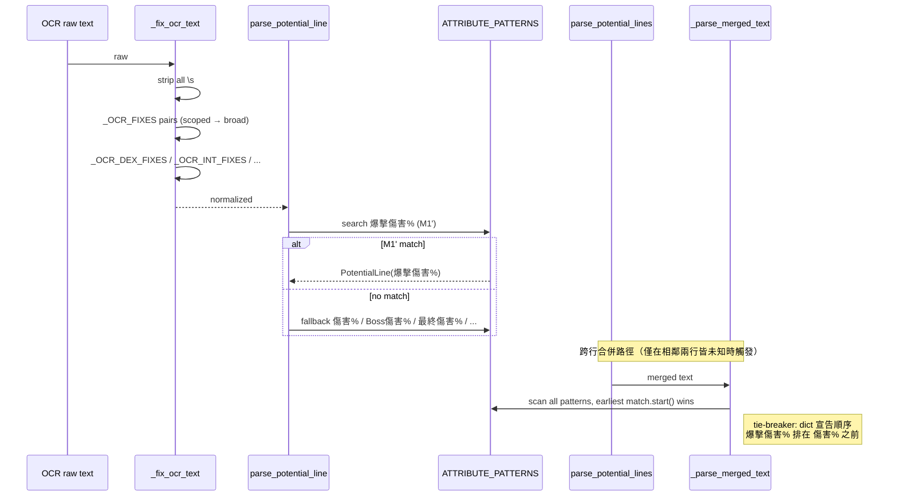

# OCR 爆擊傷害泛化辨識 Technical Spec

> 本 spec 實作 [0-feasibility-study/1-generalized-recognition.md](./0-feasibility-study/1-generalized-recognition.md) Section 6 的 **Option M3**（M1' 受限萬用字元 regex + M2 字串對修補）。
> 相關背景：[0-feasibility-study.md](./0-feasibility-study/0-feasibility-study.md)（整體 OCR 匹配策略研究）

## 1. Requirement Summary

### Problem

可行性研究盤點出 31 個 OCR FAIL case，其中 11 個目前無法被現行 `_OCR_FIXES` + `ATTRIBUTE_PATTERNS` 解析：

| 組別 | 變異類型 | Case |
|------|---------|------|
| A（3） | 爆擊傷害「傷」被替換 | `爆擎悔害` / `爆擎侮害` / `爆挛售害` |
| B（3） | 爆擊傷害「傷」被吃掉 | `爆華害` / `爆挛害` / `爆擎害` |
| C（1） | 爆擊傷害多出字元 | `爆馨擊傷害` |
| D（4） | 英文屬性誤讀 | `DX` / `JNT` / `TIT` / `工T` |

### Goals

1. **11/11 FAIL case 修復率**（Section 3.2 全覆蓋）
2. **零 FP 引入**：既有 238 個測試全數通過 + 新增 regression + FP guard
3. **自動涵蓋未見變體**：M1' 受限萬用字元 regex 自動吸收中段 1–3 字的未知誤讀
4. **維護成本不顯著增加**：不進入 `_OCR_FIXES` 無限線性膨脹的路徑

### Scope

**In scope**
- `app/core/condition.py` 修改：
  - `ATTRIBUTE_PATTERNS["爆擊傷害%"]` regex 收斂為 M1'
  - `_OCR_FIXES` 新增 7 條 pair（4 scoped + 3 suffix）+ 1 條英文 pair
  - `_OCR_DEX_FIXES` / `_OCR_INT_FIXES` 擴充字元集
- `tests/test_condition.py` 新增 18 個爆擊傷害 real case + 4 個英文屬性 real case + 3 個結構 boundary/order-lock/cross-row test（合計約 25 新 test）
- 其餘 `ATTRIBUTE_PATTERNS` 條目不動

**Out of scope**
- Section 3.3 的 6 個資訊損失過大 case（`976` / `%6+11` / `19+11` / `19` / `66+ INI` / `%9+ X30`）
- Option E 字元級混淆映射重構（保留作為 kill-criterion 後續升級路徑）
- 其他非爆擊傷害屬性的 OCR 修復
- UI 顯示邏輯調整

## 2. Existing Code Analysis

### Related modules

| 位置 | 責任 |
|------|------|
| [`app/core/condition.py:9-54`](../../../app/core/condition.py#L9) | `ATTRIBUTE_PATTERNS`（30+ 條屬性 regex，含本 spec 要改的 `爆擊傷害%`） |
| [`app/core/condition.py:68-159`](../../../app/core/condition.py#L68) | `_OCR_FIXES`（64 條字串 pair；本 spec 要新增 8 條 → 72 條） |
| [`app/core/condition.py:161-175`](../../../app/core/condition.py#L161) | `_OCR_DEX_FIXES` / `_OCR_INT_FIXES` 等帶邊界的 regex 修正（本 spec 擴充 2 條） |
| [`app/core/condition.py:178-199`](../../../app/core/condition.py#L178) | `_fix_ocr_text`（pipeline：strip → pair replace → regex fix） |
| [`app/core/condition.py:201-231`](../../../app/core/condition.py#L201) | `parse_potential_line` / `_try_parse`（單行解析，首個命中勝出） |
| [`app/core/condition.py:233-267`](../../../app/core/condition.py#L233) | `_parse_merged_text`（合併行解析，earliest `match.start()` 勝出） |
| [`app/core/condition.py:364-397`](../../../app/core/condition.py#L364) | `parse_potential_lines`（y 座標分列 + 相鄰皆為未知時合併） |
| [`tests/test_condition.py`](../../../tests/test_condition.py) | 238 測試（baseline）；主要相關類：`TestParsePotentialLine`、`TestParsePotentialLines` |

### Reusable components

完全沿用既有結構：**不新增模組、函式、類別**。所有變更都是既有集合（`dict` / `list` / `re.Pattern`）的內容擴充。

### Files requiring changes

1. `app/core/condition.py` — 改 1 條 regex、新增 8 條 pair、擴充 2 條 regex 字元集
2. `tests/test_condition.py` — 新增 ~25 個 test（18 爆擊傷害 real case + 4 英文屬性 real case + 3 結構 test）

## 3. Technical Solution

### 3.1 Architecture — OCR 解析流程



### 3.2 Data Model

**無變更**。`_OCR_FIXES: list[tuple[str, str]]`、`ATTRIBUTE_PATTERNS: dict[str, re.Pattern[str]]`、`PotentialLine` dataclass 維持原狀。

### 3.3 API Design

**無變更**。`parse_potential_line(text: str) -> PotentialLine` 與 `parse_potential_lines(fragments) -> list[PotentialLine]` 簽名與回傳型別不變，對 `ConditionChecker` 與 preset 呼叫端完全透明。

### 3.4 Core Logic

#### 3.4.1 `爆擊傷害%` regex 泛化

**位置**：[`app/core/condition.py:22`](../../../app/core/condition.py#L22)

```python
# 舊（嚴格：爆 + 1 char + 傷害）
"爆擊傷害%": re.compile(r"爆.\s*傷害\s*[:\uff1a]?\s*\+?\s*(\d+) ?%"),

# 新（無排除字元的泛化）
"爆擊傷害%": re.compile(
    r"爆.{1,3}\s*傷?[害喜]\s*[:\uff1a]?\s*\+?\s*(\d+) ?%"
),
```

**設計決策**：

| 片段 | 用途 |
|------|------|
| `爆` | 強前綴錨定（唯一識別錨） |
| `.{1,3}` | 中段 1–3 任意字（不預設排除） |
| `傷?` | 允許 B 組（傷被吃掉） |
| `[害喜]` | 吸收 害→喜 誤讀 |
| `{1,3}` 上界 | 限制跨行 runaway 匹配範圍（非針對特定字元，純粹防止跨越整行污染） |

**方法論說明（`只收真實觀察` 原則）**：

原始 v1 草案曾使用 `[^時終率機傷]{1,3}` 排除字元集，其中 `時/終/率/機` 來自 Codex 對抗性推演（假設 `攻擊Boss怪物時傷害` 崩壞成 `爆擊時傷害`、`爆擊機率` 變 `爆擊機害` 等），`傷` 來自合成 `爆集害 → 爆傷害` 的 pipeline 互動假設。這 5 個字元**沒有任何真實 OCR 輸出對應**（git history、memory、可行性研究 Section 3 全無 `爆時/爆終/爆率/爆機/爆集` 類型觀察）。

經 user 要求校正方法論：**「沒有發生過的 pattern 不應預先處理」**。預設排除會帶來以下代價：

| 代價 | 說明 |
|------|------|
| FN 風險 | 若排除字元未來真的出現在合法爆擊傷害變體中，regex 會漏判（FN 比 FP 好，但仍是成本） |
| 維護噪音 | defensive test 測試不存在的案例，誤導後續讀者以為這些是真實案例 |
| 方法論不一致 | 可行性研究案例表禁止推演案例，但程式排除集又偷渡進來，自相矛盾 |

因此最終版 regex **不預先排除任何字元**。若未來出現真實的 damage-family FP，再走 kill criterion 升級至 Option E 或局部補強。

#### 3.4.2 `_OCR_FIXES` 新增 8 條 pair

**位置**：[`app/core/condition.py:68-159`](../../../app/core/condition.py#L68)

**插入策略**：scoped pair（含 `爆` 前綴者）**必須**在 broad pair `爆華 → 爆擊` 之前（broad pair 現位於 [L137](../../../app/core/condition.py#L137)）；suffix pair 併入現有 `*害 → 傷害` 群組（約 L104-118）；英文 pair 併入屬性誤讀群組（約 L139-143）。

```python
# 群組 1：scoped 爆擊傷害 pair（MUST 排在 爆華 → 爆擊 之前）
("爆華害", "爆擊傷害"),   # 擊→華 + 傷 dropped
("爆挛害", "爆擊傷害"),   # 擊→挛 + 傷 dropped
("爆擎害", "爆擊傷害"),   # 擊→擎 + 傷 dropped
("爆馨擊", "爆擊"),       # 插入 馨（爆馨擊傷害 → 爆擊傷害）

# 群組 2：suffix 傷害 pair（加入既有 低害/值害/佩害/... 群組）
("悔害", "傷害"),          # 傷→悔
("侮害", "傷害"),          # 傷→侮
("售害", "傷害"),          # 傷→售

# 群組 3：英文屬性 pair（加入 LIK/LJK/... 群組）
("工T", "INT"),           # I→工 + N→空
```

**兩條處理路徑並存**（為何 A 組與 B 組拆開處理）：

| 組 | Case | 路徑 |
|---|------|------|
| A | `爆擎悔害` | suffix pair `悔害 → 傷害` 先觸發 → `爆擎傷害` → M1' regex 直接命中 |
| B | `爆擎害` | scoped pair `爆擎害 → 爆擊傷害` 直接命中（不經 regex 擴散） |

兩條路徑互補，確保「末字替換」與「傷被吃掉」兩種變異都被覆蓋。

#### 3.4.3 `_OCR_DEX_FIXES` / `_OCR_INT_FIXES` 擴充

**位置**：[`app/core/condition.py:166, 170`](../../../app/core/condition.py#L166)

```python
# 舊
_OCR_DEX_FIXES = re.compile(
    r"(?<![A-Za-z0-9\u4e00-\u9fff:\uff1a])(?:DET|DEI|DEK|DEY|DE)(?=[+:\uff1a\d])"
)
_OCR_INT_FIXES = re.compile(
    r"(?<![A-Za-z0-9])(?:IINT|IHT|IMT|1NT|1IT|1TT|IIT|IT|IM)(?=[\+\d:\uff1a])"
)

# 新
_OCR_DEX_FIXES = re.compile(
    r"(?<![A-Za-z0-9\u4e00-\u9fff:\uff1a])(?:DET|DEI|DEK|DEY|DE|DX)(?=[+:\uff1a\d])"
)
_OCR_INT_FIXES = re.compile(
    r"(?<![A-Za-z0-9])(?:IINT|IHT|IMT|1NT|1IT|1TT|IIT|IT|IM|JNT|TIT)(?=[\+\d:\uff1a])"
)
```

**邊界安全**：兩條 regex 均保留 `(?<![A-Za-z0-9...])` 前置排除與 `(?=[+:\uff1a\d])` 後置斷言，`DX+9%` / `JNT+6%` / `TIT+9%` 僅在 OCR 屬性上下文（後接 `+` 或冒號或數字）命中，不會誤抓 `SUFFIX` / `SITTING` / `JUNCTION` 等詞彙。

#### 3.4.4 跨行合併路徑的處理

**合併觸發條件**（[`condition.py:382-395`](../../../app/core/condition.py#L382)）：三條件全滿足才會合併相鄰 `i` / `i+1` 兩行：

| # | 條件 | 程式碼 |
|---|------|--------|
| 1 | 兩行的 `attribute` 皆為 `未知` | `result[i].attribute != "未知" or result[i + 1].attribute != "未知": continue` |
| 2 | 兩行的原始文字 strip 後皆非空 | `not rows[i].strip() or not rows[i + 1].strip(): continue` |
| 3 | 下一行 lstrip 後不以 `%` 開頭（避免偷走隔壁行的 %） | `rows[i + 1].lstrip().startswith("%"): continue` |

**Pair 層的單行優先效應**：suffix pair（`悔害/侮害/售害 → 傷害` 等）先將「傷被替換」的變體在單行解析階段拉回 `傷害%`，使該行不再是未知，連帶阻斷合併路徑（合併條件 #1 不成立）。這是 pair 層的自然副作用，**不是為了擋任何推演 FP**。

**Section 6.3 Case A**（真實觀察：兩行連續 `售害+9%`）驗證此行為：兩行各自被 pair 解析為 `傷害%`，不進入合併路徑。

#### 3.4.5 順序不變量（Invariants）

| # | 約束 | 若違反的後果 | 嚴格性 |
|---|------|-------------|:------:|
| 1 | scoped pair `爆華害 → 爆擊傷害` 必須在 broad `爆華 → 爆擊` 之前 | broad pair 先觸發，`爆華害` 降階為 `爆擊害`，scoped pair 後續永不生效。M1' 的 `傷?` optional 仍可命中，**attribute/value 正確**，但：(a) 單行 `parse_potential_line` raw_text 不變（保留原文）；(b) 合併路徑 `_parse_merged_text` 的 raw_text 會變成 `爆擊害+9%` 而非 `爆擊傷害+9%`，斷言 canonical raw_text 的測試會失敗；(c) scoped pair 分支失去測試覆蓋 | **防禦/風格**（非正確性，建議保留） |
| 2 | `ATTRIBUTE_PATTERNS` 中 `爆擊傷害%` 位於 `傷害%` 之前 | `_parse_merged_text` 在出現相同 `match.start()` 時以 dict 迭代順序作為 tie-breaker；爆擊傷害較具體，必須優先 | **正確性** |
| 3 | `_fix_ocr_text` 內先 pair replace 再 regex fix | 既有 pipeline 假設；改動會破壞既有測試 | **正確性** |
| 4 | `傷害%` pattern 的負後瞻 `(?<![擊擎時終])` 保留 | 既有 FP 防護，與 M1' 正交，移除會重新打開 `爆擊傷害 → 傷害` 的誤判路徑 | **正確性** |

## 4. Risks and Dependencies

| # | 風險 | 影響 | 機率 | 緩解 |
|---|------|------|:----:|------|
| R1 | M1' 放寬後出現真實 damage-family FP | 錯判洗掉好潛能 | 低 | Section 8 kill criterion：首次觀察到 damage-family FP 立即升級 Option E 或補 scoped pair |
| R2 | pair 順序寫錯導致 scoped pair 被 broad pair preempt | scoped pair 分支未被覆蓋；merged-path raw_text 變成 `爆擊害+9%` 使斷言 canonical raw_text 的測試失敗。**attribute/value 仍會由 M1' regex 正確命中**，非 hard correctness bug，但破壞測試覆蓋 | 中 | Section 3.4.5 Invariant 1；插入位置加 `# MUST come before 爆華 → 爆擊` 註解；`test_m3_scoped_pair_order_locked_via_merge_raw_text` 自動偵測 |
| R3 | `TIT` / `JNT` 邊界 regex 在未預期文字抓到 | 污染其他屬性解析 | 低 | 保留 `(?<![A-Za-z0-9])...(?=[+:\uff1a\d])` 邊界斷言；test 覆蓋 `SITTING` 非屬性字串 |
| R4 | M1' 放寬後，既有 238 個測試可能意外失敗 | 既有屬性誤判 | 低 | CI 必須全數通過才合併；precommit-fast gate |

**依賴**：無外部相依變更。純 `app/core/condition.py` 內部修改，不影響 `ConditionChecker` 介面、preset 模式、或 UI 層。

## 5. Work Breakdown

| # | 任務 | 檔案 | 預估 |
|---|------|------|:---:|
| T1 | 修改 `爆擊傷害%` regex 為 `爆.{1,3}\s*傷?[害喜]...`（無排除字元）| `app/core/condition.py:22` | 0.1d |
| T2 | 新增 4 條 scoped 爆擊傷害 pair（順序置於 `爆華 → 爆擊` 之前）| `app/core/condition.py:68-159` | 0.1d |
| T3 | 新增 3 條 suffix 傷害 pair（加入既有 `*害 → 傷害` 群組）| `app/core/condition.py:68-159` | 0.1d |
| T4 | 新增 `工T → INT` pair | `app/core/condition.py:68-159` | 0.05d |
| T5 | 擴充 `_OCR_DEX_FIXES` 加入 `DX` | `app/core/condition.py:166` | 0.05d |
| T6 | 擴充 `_OCR_INT_FIXES` 加入 `JNT` / `TIT` | `app/core/condition.py:170` | 0.05d |
| T7 | 新增 18 個爆擊傷害 real-case regression tests + 4 個英文屬性 tests | `tests/test_condition.py` | 0.3d |
| T8 | 新增 boundary tests（`{1,3}` 上下界）+ order-lock test + Case A 跨行測試 | `tests/test_condition.py` | 0.15d |
| T9 | 跑 `uv run pytest tests/test_condition.py -v`，確保全綠 | — | 0.1d |
| T10 | `/codex-review-fast` + `/codex-test-review` + `/precommit-fast` auto-loop | — | 0.1d |

**合計**：~1 day

## 6. Testing Strategy

### 6.1 Real-case coverage — 爆擊傷害 18 個使用者提供案例

> **真實案例清單（來源：user 提供）**。每一個 case 都對應一筆實際遊戲 OCR 輸出，無推演、無合成。

| # | Input | 變異類型 | 解析路徑 | 對應 test |
|:-:|-------|---------|---------|-----------|
| 1 | `爆馨擊傷害+9%` | 插入 `馨` | scoped pair `爆馨擊→爆擊` → M1' | `test_m3_crit_damage_extra_xin` |
| 2 | `爆草焦害+9%` | 擊→草 + 焦害→傷害 | existing pair + M1' | `test_ocr_fix_crit_damage_jiao_hai` |
| 3 | `爆吉但害+9%` | 擊→吉 + 但害→傷害 | existing pair + M1' | `test_ocr_fix_crit_damage_bao_ji_dan_hai` |
| 4 | `煜華僵害+9%` | 爆擊→煜華 + 僵害→傷害 | existing pair + M1' | `test_ocr_fix_crit_damage_yu_hua_jiang_hai` |
| 5 | `爆華僵害+9%` | 擊→華 + 僵害→傷害 | existing pair + M1' | `test_ocr_fix_crit_damage_bao_hua_jiang_hai` |
| 6 | `爆擎焦害+9%` | 擊→擎 + 焦害→傷害 | existing suffix pair + M1' 吸收 `擎` | `test_m3_crit_damage_baoqing_jiaohai` |
| 7 | `爆擎悔害+9%` | 擊→擎 + 傷→悔 | suffix pair `悔害→傷害` + M1' | `test_m3_crit_damage_baoqing_huihai` |
| 8 | `爆擎侮害+9%` | 擊→擎 + 傷→侮 | suffix pair `侮害→傷害` + M1' | `test_m3_crit_damage_baoqing_wuhai` |
| 9 | `爆華傷喜+9%` | 擊→華 + 害→喜 | `爆華→爆擊` + `傷喜→傷害` | `test_m3_crit_damage_baohua_shangxi` |
| 10 | `爆挛傷害+9%` | 擊→挛 | M1' 直接吸收 `挛` | `test_m3_crit_damage_baoluan_shanghai` |
| 11 | `爆馨傷害+9%` | 擊→馨 | M1' 直接吸收 `馨` | `test_m3_crit_damage_baoxin_shanghai` |
| 12 | `爆挛售害+9%` | 擊→挛 + 傷→售 | suffix pair `售害→傷害` + M1' | `test_m3_crit_damage_baoluan_shouhai` |
| 13 | `爆撃焦害+9%` | 擊→撃（JP kanji）+ 焦害→傷害 | existing suffix + M1' 吸收 `撃` | `test_m3_crit_damage_jp_kanji_geki_jiaohai` |
| 14 | `爆華恆喜+9%` | 擊→華 + 傷→恆 + 害→喜 | `爆華→爆擊` + M1' 吸收 `擊恆` + `[害喜]` 命中 `喜` | `test_m3_crit_damage_baohua_hengxi` |
| 15 | `爆馨偏喜+9%` | 擊→馨 + 傷→偏 + 害→喜 | M1' 吸收 `馨偏` + `[害喜]` 命中 `喜` | `test_m3_crit_damage_baoxin_pianxi` |
| 16 | `爆華害+9%` | 擊→華 + 傷 dropped | scoped pair `爆華害→爆擊傷害` | `test_m3_crit_damage_baohua_missing_shang` |
| 17 | `爆挛害+9%` | 擊→挛 + 傷 dropped | scoped pair `爆挛害→爆擊傷害` | `test_m3_crit_damage_baoluan_missing_shang` |
| 18 | `爆擎害+9%` | 擊→擎 + 傷 dropped | scoped pair `爆擎害→爆擊傷害` | `test_m3_crit_damage_baoqing_missing_shang` |

### 6.2 其他屬性 coverage

**D 組（英文屬性誤讀）**

| Input | 期望屬性 | 期望值 | 解析路徑 |
|-------|---------|:----:|---------|
| `DX+9%` | DEX% | 9 | `_OCR_DEX_FIXES` |
| `JNT+9%` | INT% | 9 | `_OCR_INT_FIXES` |
| `TIT+9%` | INT% | 9 | `_OCR_INT_FIXES` |
| `工T+9%` | INT% | 9 | pair `工T→INT` |

**既有屬性不可退化（真實遊戲文字）**

| Input | 期望屬性 | 期望值 | 為何不會被 M1' 誤吞 |
|-------|---------|:----:|----------|
| `攻擊Boss怪物時傷害+12%` | Boss傷害% | 12 | 無 `爆` 前綴，M1' 不搜尋 |
| `爆擊機率+25%` | 爆擊機率% | 25 | 有 `爆` 但 `爆擊機率` 無 `害/喜`，M1' 不命中 |
| `最終傷害+15%` | 最終傷害% | 15 | 無 `爆` 前綴 |
| `傷害+10%` | 傷害% | 10 | 無 `爆` 前綴 |
| `SITTING: +10` | 未知 | 0 | `_OCR_INT_FIXES` 邊界斷言拒絕 `SITTING` 中的 `TIT` |

**Boundary tests（`{1,3}` 上下界）**

| Input | 期望屬性 | 目的 |
|-------|---------|------|
| `爆擎擎擎害+9%` | 爆擊傷害% | 3 字中段 accept（如果 `{1,3}` 被改成 `{1,2}` 會失敗） |
| `爆擎擎擎擎害+9%` | 未知 | 4 字中段 reject（如果 `{1,3}` 被改成 `{1,4}` 會失敗） |

### 6.3 跨行合併路徑（Case A — 真實觀察）

**Case A**：兩行連續 `售害+9%` — pair 層阻斷合併

```python
# test_m3_scoped_pair_blocks_cross_row_concat_case_a
fragments = [
    ("售害+9%", 100.0),   # 單行經 suffix pair 解析為 傷害%=9
    ("售害+7%", 200.0),   # 單行經 suffix pair 解析為 傷害%=7
    ("", 300.0),
]
lines = parse_potential_lines(fragments, num_rows=3)
# 合併條件 #1（兩行皆為未知）不成立 → 不進入合併路徑
assert lines[0].attribute == "傷害%" and lines[0].value == 9
assert lines[1].attribute == "傷害%" and lines[1].value == 7
```

### 6.4 Test 放置位置

| 類別 | Test class | 命名前綴 |
|------|-----------|---------|
| 單行 real case | `TestParsePotentialLine` | `test_m3_crit_damage_<variant>` / `test_m3_dex_as_dx` / `test_m3_int_as_jnt` / ... |
| 合併行 real case | `TestParsePotentialLines` | `test_m3_crit_damage_<variant>_merged` |
| Boundary tests | `TestParsePotentialLine` | `test_m3_regex_boundary_*` |
| Order-lock invariant | `TestParsePotentialLines` | `test_m3_scoped_pair_order_locked_via_merge_raw_text` |

### 6.5 Execution

```bash
uv run pytest tests/test_condition.py -v
```

**成功準則**：既有 238 tests + M3 新增 25 tests = 263 tests 全部 PASS，無 warning escalation、無既有測試 regression。

## 7. Open Questions

（延自可行性研究 Section 11）

- [ ] M3 上線後累積多少 cube 執行樣本才能確認 FP 風險已消除？建議按月觀察，累積 30 天且無 damage-family 誤判即視為 stable
- [ ] Option E（字元級混淆映射）正式啟動的 owner 與時機 — 目前所有 kill criterion 均未觸發，不預先啟動
- [ ] Section 3.3 的 6 個「無法可靠修復」case 是否需要在 UI 層顯示「辨識失敗，建議手動檢查」— **不屬於本 spec 範圍**，未來另立 feature request
- [ ] `攻擊Boss怪物時傷害` 是否有其他裝備類型變體 — 若出現，需另行擴充 Boss regex（與本 spec 正交）

## 8. Kill Criteria（延自可行性研究 Section 9.4）

下列任一條件成立，升級至 Option E：

| # | 條件 |
|---|------|
| 1 | 首次確認 damage-family FP（爆擊傷害 / 傷害 / Boss 傷害 / 最終傷害 / 爆擊機率 之間的誤判） |
| 2 | `_OCR_FIXES` 總條數超過 80 |
| 3 | 連續兩個月每月新增 > 10 條 pair |
| 4 | 單月新增的 pair 中 > 25% 屬於既有混淆字家族的變體 |

升級流程：建立新的 feasibility sub-study（如 `2-char-confusion-mapping.md`）→ 新 tech spec → 重構。

## 9. 方法論附註：「只收真實觀察」原則延伸到 code-level 防禦

本 spec v1 初稿使用 `[^時終率機傷]{1,3}` 作為中段排除集，四個字元來自：

| 字元 | 原始理由 | 真實案例？ |
|:---:|---|:---:|
| `時` | Codex 推演：`攻擊Boss怪物時傷害` 崩壞成 `爆擊時傷害` | ❌ |
| `終` | Codex 推演：`最終傷害` 崩壞成 `爆擊終害` | ❌ |
| `率` / `機` | Codex 推演：`爆擊機率` 的 `率/機 → 害` 誤讀 | ❌ |
| `傷` | 合成測試：`爆集害 → 爆傷害` 的 pipeline 互動 | ❌ |

經 user 校正：**「只收真實觀察」規則不僅適用於可行性研究的案例表，也適用於 code-level 的 regex 排除集、defensive test、FP guard**。理由：

1. **一致性**：案例表禁止推演，程式排除集卻允許偷渡，自相矛盾
2. **FN 成本**：若排除字元未來真的出現在合法輸入中（例如 PaddleOCR 升級後產生新誤讀形狀），regex 會漏判
3. **維護噪音**：defensive test 測試不存在的案例，會誤導後續讀者以為這些是真實案例，導致誤花時間理解
4. **Kill criterion 已有設計**：Section 8 已涵蓋 damage-family FP 的升級路徑，不需要預先過度設計

因此最終版的決策：

- Regex **不預先排除任何字元**：`爆.{1,3}\s*傷?[害喜]`
- Test 中**不包含**任何針對 `爆擊時傷害 / 爆擊機害 / 爆擊率害 / 爆擊終害 / 爆集害 / 爆擎+時害` 等推演案例的 defensive test
- 如果未來真的出現 damage-family FP，依 Section 8 升級流程處理

此方法論規則應同步更新到 memory（`feedback_case_vs_inference.md`），延伸到所有 sd0x-dev-flow 可行性研究與 tech spec 的寫作準則。

---

**Status**: Draft
**Input**: [1-generalized-recognition.md](./0-feasibility-study/1-generalized-recognition.md) Option M3（方法論收斂後）
**Next**: `/feature-dev` → `/codex-review-fast` → `/codex-test-review` → `/precommit-fast`
