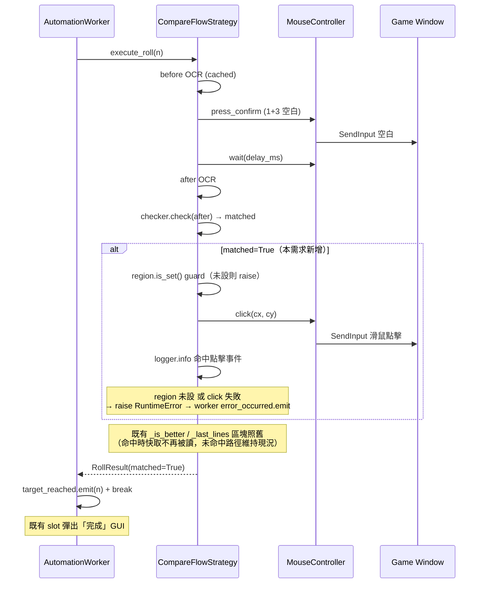

# Tech Spec: Recovery Cube Auto-Commit on Match

> **Created**: 2026-04-14
> **Requirements**: [1-requirements.md](./1-requirements.md)
> **Scope**: `app/cube/compare_flow.py`, `app/core/mouse.py`, `tests/test_compare_flow.py`, new `tests/test_mouse.py`

## 1. Requirement Summary

- **Problem**: 恢復附加方塊命中後腳本只彈 GUI 等使用者手動按「使用」；AFK 期間遊戲若斷線會還原 before。
- **Goals**: 命中當下由腳本在 `potential_region` 內送出一次滑鼠點擊，讓遊戲端即刻落袋，然後立即結束自動化。
- **Scope**: CompareFlow 命中分支 + `MouseController` 新增 `click()`。
- **Out of scope**: SimpleFlow、未命中路徑的快取/`_is_better` 清理、斷線偵測、新設定欄位。

對應 requirements：FR-1 ~ FR-4 / NFR-1 ~ NFR-3。

## 2. Existing Code Analysis

### 2.1 可重用元件

| 檔案 | 組件 | 用途 |
|------|------|------|
| `app/core/mouse.py:74-80` | `_find_game_hwnd` | 取得並快取遊戲視窗 handle |
| `app/core/mouse.py:116-133` | `_ensure_game_foreground` | 送輸入前確認前景為遊戲視窗 |
| `app/core/mouse.py:161-192` | `MouseController` | 既有鍵盤控制器，新增 mouse click 將同級擴充 |
| `app/core/mouse.py:24-68` | `SendInput` struct 定義（`_INPUT`, `_MOUSEINPUT` 等）| 已有 `_MOUSEINPUT`，尚未使用 |
| `app/models/config.py:12-24` | `Region` + `Region.is_set()` | 提供點擊座標來源與有效性檢查 |
| `app/cube/compare_flow.py:24-63` | `CompareFlowStrategy.execute_roll` | 命中判定已在 `matched = self.checker.check(after_lines)` |
| `app/core/automation.py:105-124` | `AutomationWorker` 主迴圈 | `matched=True` 時 `target_reached.emit` 並 break（現有行為即「立即結束」，無需改動）|

### 2.2 需新增/修改的檔案

| 檔案 | 改動類型 | 概要 |
|------|---------|------|
| `app/core/mouse.py` | 新增 | `_send_click`（低階 SendInput）、`MouseController.click(x, y)` |
| `app/cube/compare_flow.py` | 修改 | `execute_roll` 於 `matched=True` 分支：先檢 `region.is_set()`（未設則 raise）→ 取中心座標 → `logger.info` → 呼叫 `self.mouse.click(cx, cy)`；點擊失敗 raise |
| `tests/test_mouse.py` | 新增 | 針對 `click()` 的 unit test（mock ctypes + 前景檢查）|
| `tests/test_compare_flow.py` | 修改 | 新增 `test_click_on_match` / `test_no_click_on_miss` / `test_click_uses_region_center` |

### 2.3 為何不需動 `AutomationWorker`

既有 `run()` 於 `result.matched=True` 時已 `break` 並 `target_reached.emit(roll_number)`；完成彈窗由消費端 slot 觸發。**無需改動** worker，即可滿足 FR-2（點擊完成後立即跳完成彈窗、結束自動化）。

## 3. Technical Solution

### 3.1 Architecture



### 3.2 Data Model

**無新增 data class / config 欄位。**

- 點擊座標來源：`self.config.potential_region: Region`
- 點擊點：`(region.x + region.width // 2, region.y + region.height // 2)`（§3.4 詳述）

### 3.3 API Design

#### 新增：`MouseController.click`

```python
def click(self, x: int, y: int) -> bool:
    """在絕對螢幕座標 (x, y) 送出一次左鍵點擊。

    送鍵前會檢查前景是否為遊戲視窗，不是的話自動拉回（沿用 _ensure_game_foreground）。
    若 stop_flag 已觸發則直接回傳 False，不發出點擊。
    """
```

| 契約 | 說明 |
|------|------|
| 回傳 | `True` = SendInput 兩個事件（down + up）皆成功；`False` = 被 stop_flag 中斷、`SetCursorPos` 失敗或 SendInput 失敗 |
| 前景保護 | 呼叫 `_ensure_game_foreground()`（與 `press_confirm` 行為一致）|
| 中斷 | 檢查 `self.stopped` 後再 `_send_click`；與 `press_confirm` 的 early-return 同語義 |
| 副作用 | `SetCursorPos(x, y)`→（若回 0 視為失敗，不送點擊）→`SendInput(MOUSEEVENTF_LEFTDOWN)`→sleep `_KEY_HOLD_SEC`→`SendInput(MOUSEEVENTF_LEFTUP)` |

#### 新增：`_send_click` (module-level helper)

```python
def _send_click() -> int:
    """於當前游標位置送出一次左鍵 down+up，回傳成功注入的事件數（0/1/2）。"""
```

### 3.4 Core Logic

#### 3.4.1 `MouseController.click` 實作骨架

```python
# app/core/mouse.py（新增常數）
_MOUSEEVENTF_LEFTDOWN = 0x0002
_MOUSEEVENTF_LEFTUP   = 0x0004
_INPUT_MOUSE          = 0

def _send_click() -> int:
    down = _INPUT()
    down.type = _INPUT_MOUSE
    down.union.mi.dwFlags = _MOUSEEVENTF_LEFTDOWN
    r1 = ctypes.windll.user32.SendInput(1, ctypes.byref(down), ctypes.sizeof(_INPUT))
    time.sleep(_KEY_HOLD_SEC)
    up = _INPUT()
    up.type = _INPUT_MOUSE
    up.union.mi.dwFlags = _MOUSEEVENTF_LEFTUP
    r2 = ctypes.windll.user32.SendInput(1, ctypes.byref(up), ctypes.sizeof(_INPUT))
    return r1 + r2

# MouseController
def click(self, x: int, y: int) -> bool:
    _ensure_game_foreground()
    if self.stopped:
        return False  # silent（不記 warning），語義同 press_confirm
    if not ctypes.windll.user32.SetCursorPos(int(x), int(y)):
        logger.warning("SetCursorPos 失敗: (%d, %d)", x, y)
        return False
    result = _send_click()
    if result < 2:
        logger.warning("SendInput(mouse) 失敗: 預期 2 事件，實際 %d", result)
        return False
    return True
```

#### 3.4.2 CompareFlow 命中分支修改

```python
# app/cube/compare_flow.py execute_roll 最後一段
matched = self.checker.check(after_lines)
logger.info("#%05d 判斷結果: %s", roll_number, "✅ 符合" if matched else "❌ 不符合")

if matched:
    region = self.config.potential_region
    if not region.is_set():
        # 防禦性 guard：理論上 matched=True + region 未設很罕見（OCR 會回空），
        # 但真的發生時不能盲點 (0,0)；以 RuntimeError 走既有 error_occurred 路徑。
        raise RuntimeError(f"#{roll_number:05d} 命中但 potential_region 未設定，無法送出點擊")
    cx = region.x + region.width // 2
    cy = region.y + region.height // 2
    logger.info("#%05d 命中 → 點擊 potential_region 中心 (%d, %d)", roll_number, cx, cy)
    if not self.mouse.click(cx, cy):
        # 落袋點擊失敗：不能讓 worker 以為已成功。拋例外，由 AutomationWorker 既有
        # try/except（automation.py:109-114）以 error_occurred 呈現給使用者。
        raise RuntimeError(f"#{roll_number:05d} 命中後點擊失敗")
    # 成功落袋；RollResult(matched=True) 交由 worker 結束自動化（FR-2）。

# 既有 _is_better / _last_lines 塊照舊（不在本次 scope）

return RollResult(roll_number=roll_number, lines=after_lines, matched=matched)
```

**關鍵設計選擇**：

| 決策點 | 選擇 | 理由 |
|--------|------|------|
| 點擊邏輯放哪？ | `CompareFlowStrategy` 命中分支 | 方塊類型相關邏輯屬策略；`AutomationWorker` 不應知道「哪個策略需要點擊」 |
| 點擊座標？ | `potential_region` 中心點 | FR-1 要求「區域內任一點」；中心點實作最單純且穩定 |
| 低階實作？ | `SetCursorPos` + `SendInput` | 與既有 `_send_key` 同風格（`ctypes.windll.user32`）；絕對座標簡單直觀 |
| 點擊後是否等待或驗證？ | 否 | FR-2 明確禁止；requirements §7 Fact 已確認單次點擊等於「使用」|
| 未命中分支？ | 不動 | FR-3 要求未命中流程保持原狀；既有 `_is_better` / 快取塊保留 |
| 初始命中（automation.py:93-96）？ | 不加點擊 | 使用者尚未按「重新設定」，畫面非比較 UI，點擊無意義；`target_reached.emit(0)` 維持既有行為 |

## 4. Risks and Dependencies

| ID | 風險 | 影響 | 緩解 |
|----|------|------|------|
| R1 | `SetCursorPos` + `SendInput` 在 DPI 縮放 / 多螢幕下座標計算錯誤 | 點到比較 UI 外 → 落袋失敗 | DPI 轉換已由 `app/gui/region_selector.py:61` 的邏輯→實體像素換算處理；`potential_region` 存的是實體像素絕對座標，`SetCursorPos` 也吃實體像素，同源使用不會引入新偏差 |
| R2 | 命中當下遊戲畫面已切換（例如誤觸其他彈窗） | 點擊落在錯誤 UI | 前景檢查只能保證視窗是遊戲；不在本期 scope 內加畫面辨識（requirements Non-Goals）；接受此罕見情境為 known trade-off |
| R3 | `MouseController.click` 在 CI 無 Windows 環境無法整合測試（`ctypes.windll` 僅 Windows 有）| 測試覆蓋只能靠 mock | Unit test 用 `unittest.mock.patch('app.core.mouse.ctypes.windll', create=True)` 注入假物件；整合測試標記為手動 E2E |
| R4 | 點擊失敗（`SetCursorPos` 回 0 或 `SendInput` < 2）卻仍 `target_reached.emit` | 使用者誤以為落袋 | §3.4.2 已改為 `click()` 回 False 時 `raise RuntimeError`，由 `AutomationWorker` 既有 try/except（`automation.py:111-114`）轉成 `error_occurred` 給使用者；**不會誤觸發 target_reached** |
| R5 | 使用者於命中瞬間按 stop | `self.stopped` 為 True，click 被略過、回 False，依 R4 路徑走 error_occurred | 可接受：停止優先於點擊；錯誤訊息含 roll_number 供追溯 |

依賴：

- Windows API `user32.SetCursorPos` / `user32.SendInput`（現況已依賴，無新依賴）
- 既有 `PotentialLine` / `Region` / `ConditionChecker` 介面不變

## 5. Work Breakdown

| # | 工作項 | 檔案 | 預估 | 驗證 |
|---|--------|------|------|------|
| W1 | 新增 `_send_click` + 常數 | `app/core/mouse.py` | 15 min | `test_mouse.py::test_send_click_returns_event_count` |
| W2 | 新增 `MouseController.click` | `app/core/mouse.py` | 20 min | `test_mouse.py::test_click_calls_foreground_then_cursor_then_sendinput` / `test_click_respects_stop_flag` |
| W3 | CompareFlow 命中分支插入 click + log + 失敗 raise | `app/cube/compare_flow.py` | 20 min | `test_compare_flow.py::test_click_on_match` + `test_match_raises_on_click_failure` |
| W4 | CompareFlow 未命中路徑不觸發 click | （同上）| 5 min（同 PR）| `test_compare_flow.py::test_no_click_on_miss` |
| W5 | CompareFlow 點擊座標為 region 中心 | （同上）| 5 min（同 PR）| `test_compare_flow.py::test_click_uses_region_center` |
| W6 | 手動 E2E 驗收 | 實機 | 20 min | UC-1 實測：AFK 跑到命中，回來後裝備已是 after；log 有點擊事件 |

全部：~85 min 開發 + 20 min E2E。

## 6. Testing Strategy

### 6.1 Unit Tests（`tests/test_mouse.py`, 新檔）

| 測項 | 內容 |
|------|------|
| `test_send_click_returns_event_count` | mock `SendInput` 回 1，驗證 `_send_click` 回傳 2 |
| `test_click_calls_foreground_then_cursor_then_sendinput` | 用 `mock.patch` 監測呼叫順序：`_ensure_game_foreground` → `SetCursorPos(x, y)` → `SendInput` x2 |
| `test_click_respects_stop_flag` | 綁定已 set 的 Event，驗證 `click()` 回 False 且未呼叫 `SetCursorPos` |
| `test_click_returns_false_on_setcursorpos_failure` | mock `SetCursorPos` 回 0，驗證回 False 且不送 `SendInput` |
| `test_click_returns_false_on_sendinput_failure` | mock `SendInput` 回 0，驗證回 False 並有 logger.warning |

**跨平台 Mock 模式**（CI 可能非 Windows；`ctypes.windll` 在非 Windows 不存在）：

```python
# tests/test_mouse.py
from unittest.mock import patch, MagicMock
import threading

def _make_fake_windll():
    u = MagicMock()
    u.user32.SetCursorPos.return_value = 1  # non-zero = success
    u.user32.SendInput.return_value = 1     # 每次注入 1 事件
    return u

def test_click_respects_stop_flag():
    from app.core.mouse import MouseController
    mc = MouseController()
    ev = threading.Event(); ev.set()
    mc.bind_stop_flag(ev)
    fake = _make_fake_windll()
    with patch("app.core.mouse._ensure_game_foreground"), \
         patch("app.core.mouse.ctypes.windll", fake, create=True):
        assert mc.click(100, 200) is False
        fake.user32.SetCursorPos.assert_not_called()
```

**關鍵**：`patch("app.core.mouse.ctypes.windll", fake, create=True)` 的 `create=True` 讓非 Windows 環境也能注入假物件，不會因屬性不存在而失敗。

### 6.2 Unit Tests（`tests/test_compare_flow.py`, 擴充）

沿用既有 `_make_strategy(cls)` helper 函式（`tests/test_compare_flow.py:11-25`，非 pytest fixture；由 fixture `strategy` 包裝），新增：

| 測項 | 斷言 |
|------|------|
| `test_click_on_match` | `checker.check` 回 True → `mouse.click` 被呼叫一次 |
| `test_no_click_on_miss` | `checker.check` 回 False → `mouse.click` 從未被呼叫 |
| `test_click_uses_region_center` | 設 `config.potential_region=Region(100,200,40,60)` → `click(120, 230)` |
| `test_match_returns_rollresult_on_click_success` | `mouse.click` 回 True → 正常回 `RollResult(matched=True)`，不 raise |
| `test_match_raises_on_click_failure` | `mouse.click` 回 False → `execute_roll` 拋 `RuntimeError`（由 worker `error_occurred` 接住，對應 R4）|
| `test_match_raises_when_region_unset` | `matched=True` + `region.is_set()=False` → 拋 `RuntimeError` 且 `mouse.click` 未被呼叫（守護 §3.4.2 的 is_set guard）|

**注意**：既有 test fixture 將 `config.potential_region.is_set.return_value = False`；新增測項需覆寫為 `Region(...)` 的具體實例以驗證座標計算。

### 6.3 Regression（`tests/test_compare_flow.py` 既有）

| 既有測項 | 預期 | 備註 |
|---------|------|------|
| `test_seed_skips_first_before_ocr` | 繼續 pass | 本修改未觸碰 seed / OCR 路徑 |
| `test_without_seed_first_roll_reads_twice` | 繼續 pass | 同上 |
| `test_cache_updated_after_roll` | 繼續 pass | `_last_lines` 行為未改 |
| `test_second_roll_reuses_cached_after` | 繼續 pass | 同上 |
| `test_keep_or_cancel_todo_does_not_break_cache` | 繼續 pass | `_is_better` 分支未動 |
| `test_simple_flow_seed_is_noop` | 繼續 pass | SimpleFlow 完全未觸碰 |

### 6.4 Manual E2E

依 requirements §8 Signals 1/2/3/4 逐項驗證：

1. **Signal 1（UC-1 AFK）**：設好條件，離開電腦；回來確認裝備為 after + log 有 `命中 → 點擊` 事件緊接 `target_reached.emit`。
2. **Signal 2（未命中 log）**：跑 5+ 輪未命中，`grep "命中 → 點擊" logs/*.log` 無結果。
3. **Signal 3（p95 < 500ms）**：`logger.info` 的時間戳比對，從 `判斷結果: ✅` 到 `target_reached` slot 觸發的時間差。
4. **Signal 4（log 欄位）**：log 可逐筆看到 roll_number、座標、時間戳。

### 6.5 執行

- 跑 `uv run pytest tests/test_mouse.py tests/test_compare_flow.py -v`
- 全量：`uv run pytest`
- Pre-PR：`/precommit`（lint + typecheck + test）

## 7. Open Questions

（無；requirements §9 已清空，tech-spec 層面所有決策見 §3.4 關鍵設計選擇表，無待辦。）

## 8. References

- Requirements: [1-requirements.md](./1-requirements.md)
- 現況程式：
  - `app/cube/compare_flow.py:12-97`
  - `app/core/mouse.py:116-201`
  - `app/core/automation.py:20-124`
  - `app/models/config.py:12-24`
- 既有測試：
  - `tests/test_compare_flow.py`（fixture 可重用）
- 規則：`@.claude/rules/testing.md`、`@.claude/rules/docs-writing.md`、`@.claude/rules/docs-numbering.md`
