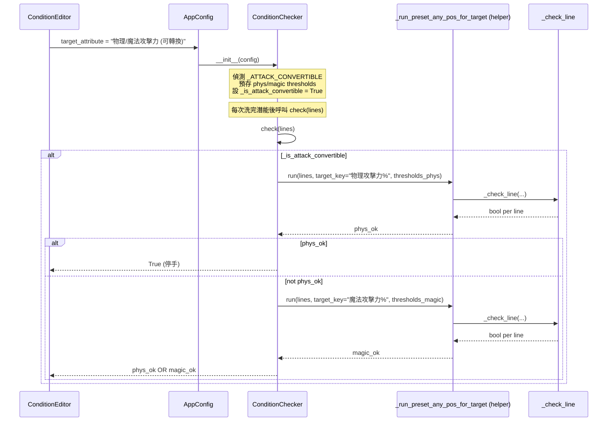

# 副手雙攻擊力（可轉換）條件 — 技術規格

> **上游文件**：[0-feasibility-study.md](./0-feasibility-study.md)
> **方案**：Option A（新增預設目標屬性字串，內部重用預設模式排列檢查邏輯）
> **已鎖定決定**：D1 整件轉換／拒絕混合；D2 僅副手；D3 僅預設模式；D4 副手屬性封閉；D5 命名 `物理/魔法攻擊力 (可轉換)`；D6 取代原「物理攻擊力」為預設值

## 1. 需求摘要

### 1.1 問題

副手（`輔助武器 (副手)`）的潛能洗練中，物理攻擊力與魔法攻擊力在遊戲內可透過「防具轉換」整件互換，但目前工具的預設模式只允許指定單一目標屬性，導致好卷（洗到非目標屬性）被繼續洗掉，造成 false negative 漏停。

### 1.2 目標

讓副手預設模式新增一個目標屬性 `物理/魔法攻擊力 (可轉換)`，當所有排皆滿足物攻門檻 **或** 所有排皆滿足魔攻門檻時即視為合格停手條件；混合洗出（例：2 物 1 魔）因整件轉換語意而拒絕。

### 1.3 範圍

| 項目 | 在範圍 | 不在範圍 |
|------|:------:|:--------:|
| 副手（輔助武器）預設模式新增選項 | ✅ | |
| 新選項取代原「物理攻擊力」為預設值 | ✅ | |
| 條件摘要 2 排 + 3 排支援 | ✅ | |
| 測試：含 OCR 非法屬性防呆 | ✅ | |
| 主武器 / 徽章同步支援 | | ❌ |
| 自訂模式（AND/OR）變更 | | ❌ |
| 配置檔 schema 變更 | | ❌ |
| CHANGELOG / release notes 更新 | | 留待 PR 階段 |

## 2. 既有程式碼分析

### 2.1 相關模組

> 以下行號為**實作後**（post-T10 precommit pass）的當前位置。

| 檔案:行 | 作用 | 本次改動 |
|---------|------|:--------:|
| `app/core/condition.py:455` | `_ATTACK_CONVERTIBLE` 常數 | ➕ 新增 |
| `app/core/condition.py:458-466` | `EQUIPMENT_ATTRIBUTES` — 裝備類型 → 可選屬性清單 | ✏️ |
| `app/core/condition.py:406-413` | `THRESHOLD_TABLE`（含主武器 + 副手各自物攻／魔攻門檻，D2 guard 參考來源）| 📖 讀取 |
| `app/core/condition.py:541-563` | `_check_line` — 單行屬性檢查（含容錯）| 📖 讀取 |
| `app/core/condition.py:566-605` | `_run_preset_any_pos` — 純函式版排列檢查 | ➕ 新增（T2 抽出）|
| `app/core/condition.py:659-700` | `generate_condition_summary` 新分支（含 D2 equip guard + 2/3 排摘要）| ✏️ |
| `app/core/condition.py:806-875` | `ConditionChecker.__init__` — 含 `_is_attack_convertible` 偵測、D2 guard、防禦性預設值 | ✏️ |
| `app/core/condition.py:877-896` | `ConditionChecker.check` — 分派鏈新增 `_is_attack_convertible` 分支 | ✏️ |
| `app/core/condition.py:898-911` | `_check_preset_any_pos` — T2 重構為 thin wrapper | 🔧 重構 |
| `app/core/condition.py:913-944` | `_check_attack_convertible` — 新方法（T5）| ➕ 新增 |
| `app/gui/condition_editor.py:332-345` | `_on_equip_changed` — UI 依裝備類型填入屬性選單 | 📖（自動生效，0 行改動）|
| `app/models/config.py:37-51` | `AppConfig` dataclass | 📖（0 行改動，完全相容）|
| `tests/test_condition.py:937-1162` | `TestConditionCheckerSubWeaponConvertible` — 新測試類（18 個 case）| ➕ 新增 |
| `tests/test_condition.py:923-934` | 既有 `test_sub_weapon` — 保留不變 | 📖 |

### 2.2 可重用元件

- **`_check_line(line, target_key, target_min, all_stats_min, accept_crit3, accept_cooldown, tolerance)`** — 單行屬性 + 容錯判定，完全可重用
- **`permutations(lines)` from `itertools`** — 排列枚舉邏輯可共用
- **`_check_preset_any_pos` 迴圈本體** — 可抽成純函式後雙方呼叫（見 §3.3）

### 2.3 需求對現有行為的風險

- 現有 `_check_preset_any_pos` 讀取 `self._target_key` / `self._s_val` / `self._r_val` / `self._include_all` / `self._all_s` / `self._all_r` 六個實例欄位。若直接讓新路徑共用這些欄位，會造成狀態污染（Codex 審查指出的重點）。對策見 §3.3。

## 3. 技術方案

### 3.1 流程設計



### 3.2 資料模型

#### 3.2.1 新常數

```python
# app/core/condition.py
_ATTACK_CONVERTIBLE = "物理/魔法攻擊力 (可轉換)"
```

#### 3.2.2 `EQUIPMENT_ATTRIBUTES` 順序調整（D6）

```python
# app/core/condition.py:459 (before)
"輔助武器 (副手)": ["物理攻擊力", "魔法攻擊力"],

# after
"輔助武器 (副手)": [_ATTACK_CONVERTIBLE, "物理攻擊力", "魔法攻擊力"],
```

**效果**：`ConditionEditor._on_equip_changed` 切換到副手時，`attr_combo.clear() + addItems(attrs)` 會自動把列首設為 `currentIndex=0`，即新選項成為預設值。

#### 3.2.3 `AppConfig` 無變更

`target_attribute` 是字串，新字串自動相容；舊 `config.json` 含 `"target_attribute": "物理攻擊力"` 亦可正常載入。

### 3.3 核心邏輯

#### 3.3.1 重構 `_check_preset_any_pos`

抽出純函式以避免狀態污染（Codex 審查 P2 修補）：

```python
# app/core/condition.py

def _run_preset_any_pos(
    lines: list[PotentialLine],
    num_lines: int,
    target_key: str,
    s_val: int,
    r_val: int,
    all_stats_min_s: int | None,
    all_stats_min_r: int | None,
    accept_crit3: bool,
    accept_cooldown: bool,
    tolerance: int,
) -> bool:
    """純函式版本的預設模式排列檢查。

    嘗試所有排列組合，找到一組三排分配使所有行都滿足目標門檻即通過。
    """
    for perm in permutations(lines[:num_lines]):
        ok = True
        for i in range(num_lines):
            is_legendary = (i == 0) if num_lines == 3 else True
            target_min = s_val if is_legendary else r_val
            if all_stats_min_s is not None:
                all_stats_min = all_stats_min_s if is_legendary else all_stats_min_r
            else:
                all_stats_min = None
            if not _check_line(
                perm[i],
                target_key,
                target_min,
                all_stats_min,
                accept_crit3=accept_crit3,
                accept_cooldown=accept_cooldown,
                tolerance=tolerance,
            ):
                ok = False
                break
        if ok:
            return True
    return False
```

`_check_preset_any_pos` 改為 thin wrapper：

```python
def _check_preset_any_pos(self, lines: list[PotentialLine]) -> bool:
    """預設模式任意位置：嘗試所有排列找到一組符合的分配。"""
    return _run_preset_any_pos(
        lines=lines,
        num_lines=self._num_lines,
        target_key=self._target_key,
        s_val=self._s_val,
        r_val=self._r_val,
        all_stats_min_s=self._all_s if self._include_all else None,
        all_stats_min_r=self._all_r if self._include_all else None,
        accept_crit3=self._is_glove,
        accept_cooldown=self._is_hat,
        tolerance=self._tolerance,
    )
```

> **回歸保證**：原 `_check_preset_any_pos` 的測試（`TestConditionChecker*` 相關）應全數通過，因為純函式僅是行為等價重構。

#### 3.3.2 新增 `_check_attack_convertible`

```python
def _check_attack_convertible(self, lines: list[PotentialLine]) -> bool:
    """副手雙攻擊力可轉換：三排全物攻或三排全魔攻皆合格。

    整件轉換語意（D1）：混合洗出（例：2 物 1 魔）不通過，因為遊戲內
    防具轉換是整件統一互換，混合無法完整轉為單一屬性。
    """
    phys_ok = _run_preset_any_pos(
        lines=lines,
        num_lines=self._num_lines,
        target_key="物理攻擊力%",
        s_val=self._phys_s_val,
        r_val=self._phys_r_val,
        all_stats_min_s=None,
        all_stats_min_r=None,
        accept_crit3=False,
        accept_cooldown=False,
        tolerance=self._tolerance,
    )
    if phys_ok:
        return True
    return _run_preset_any_pos(
        lines=lines,
        num_lines=self._num_lines,
        target_key="魔法攻擊力%",
        s_val=self._magic_s_val,
        r_val=self._magic_r_val,
        all_stats_min_s=None,
        all_stats_min_r=None,
        accept_crit3=False,
        accept_cooldown=False,
        tolerance=self._tolerance,
    )
```

> **為何拒絕混合自然成立**：`_run_preset_any_pos` 的語意是「所有排都必須滿足同一個 `target_key`」。第一次以物攻為 target 時，若某一排是魔攻，`_check_line` 回傳 False，該排列失敗；所有排列皆失敗則整次返回 False。第二次以魔攻為 target 同理。因此混合卷必然兩次都失敗 → 自動拒絕，無需額外邏輯。

#### 3.3.3 `ConditionChecker.__init__` 擴充

兩階段插入：

1. **防禦性預設值**（在萌獸／所有屬性判斷**之前**）：無論落入哪條早退分支，`self._is_attack_convertible` 都已存在，避免未來重構觸發 `AttributeError`。
2. **偵測 + D2 guard**（在 `_is_所有屬性` 判斷之後、`thresholds = THRESHOLD_TABLE[...]` 之前）：必須同時檢查裝備類型為副手，否則即便手改 config 把主武器（同樣有物／魔攻門檻，`condition.py:406-409`）設成此選項也會誤觸發。

```python
# app/core/condition.py, inside ConditionChecker.__init__

# --- 階段 1：防禦性預設值 ---
# 預設旗標：任何早退分支都不會讓後續屬性存取出錯
self._is_attack_convertible = False

# 萌獸雙終被：特殊條件
self._is_雙終被 = equip == "萌獸" and attr == "雙終被"
if self._is_雙終被:
    self._valid = True
    return

# ... _is_glove / _is_hat / _is_所有屬性 原有邏輯 ...

# --- 階段 2：偵測 + D2 guard ---
# 副手雙攻擊力（可轉換）— D2 僅允許副手，防止手改 config 繞過 UI 限制
self._is_attack_convertible = (
    attr == _ATTACK_CONVERTIBLE and equip == "輔助武器 (副手)"
)
if self._is_attack_convertible:
    equip_thresholds = THRESHOLD_TABLE.get(resolved, {})
    phys = equip_thresholds.get("物理攻擊力")
    magic = equip_thresholds.get("魔法攻擊力")
    if phys is None or magic is None:
        self._valid = False
        return
    (self._phys_s_val, self._phys_r_val), _ = phys
    (self._magic_s_val, self._magic_r_val), _ = magic
    self._valid = True
    return

# 防呆：若 attr == _ATTACK_CONVERTIBLE 但 equip 不是副手
# （例：手改 config 把主武器設成此選項），判定為無效設定
if attr == _ATTACK_CONVERTIBLE:
    self._valid = False
    return
```

#### 3.3.4 `ConditionChecker.check` 分派擴充

```python
def check(self, lines: list[PotentialLine]) -> bool:
    if not self._valid:
        return False
    if len(lines) < self._num_lines:
        return False
    if not self._use_preset:
        return self._check_custom(lines)
    if self._is_雙終被:
        return self._check_雙終被(lines)
    if self._is_所有屬性:
        return self._check_所有屬性(lines)
    if self._is_attack_convertible:              # ← 新增
        return self._check_attack_convertible(lines)
    return self._check_preset_any_pos(lines)
```

#### 3.3.5 `generate_condition_summary` 擴充

在 `thresholds = THRESHOLD_TABLE.get(resolved, {}).get(attr)` 之前插入早退分支。**D2 強制**：若非副手使用此屬性字串，回傳錯誤訊息，保持與 checker 的一致性：

```python
# app/core/condition.py, inside generate_condition_summary

if attr == _ATTACK_CONVERTIBLE:
    # D2 強制：此選項僅限副手
    if equip != "輔助武器 (副手)":
        return ["無法產生條件：『物理/魔法攻擊力 (可轉換)』僅適用於輔助武器 (副手)"]
    equip_thresholds = THRESHOLD_TABLE.get(resolved, {})
    phys = equip_thresholds.get("物理攻擊力")
    magic = equip_thresholds.get("魔法攻擊力")
    if not phys or not magic:
        return ["無法產生條件：裝備類型或屬性不正確"]
    (phys_s, phys_r), _ = phys
    (magic_s, magic_r), _ = magic
    if num_lines == 2:
        return [
            "兩排需同屬性（全物攻 或 全魔攻）且符合:",
            f"  · 物理攻擊力 {phys_s}%",
            f"  · 魔法攻擊力 {magic_s}%",
            "(副手可於遊戲內整件互轉物攻／魔攻，混合洗出不算合格)",
        ]
    return [
        "三排需同屬性（全物攻 或 全魔攻）且符合:",
        f"  · 物理攻擊力 {phys_s}% or {phys_r}%",
        f"  · 魔法攻擊力 {magic_s}% or {magic_r}%",
        "(副手可於遊戲內整件互轉物攻／魔攻，混合洗出不算合格)",
    ]
```

> **為何摘要要強調「同屬性」**：Codex 審查指出，原本「符合以下任一種屬性」措辭可能讓使用者誤以為可以混搭。新措辭明確點出「全物攻 或 全魔攻」語意，並加註「混合洗出不算合格」的提醒。T9 P2 sweep 再把括號內的「兩排／三排全物攻」簡化為「全物攻」，避免「兩排」與「三排」語境重複出現。

### 3.4 UI 影響

**無需手動修改 `condition_editor.py`**：
- `_on_equip_changed` at `app/gui/condition_editor.py:332-345` 會自動讀取新的 `EQUIPMENT_ATTRIBUTES` 填入 `attr_combo`
- `_update_summary` 會自動呼叫新的 `generate_condition_summary` 分支
- 自訂模式（`CUSTOM_SELECTABLE_ATTRIBUTES["武器"]` at `condition.py:498`）**不變更**（D3）

**可見的 UI 變化**：
1. 副手下拉選單第一項變為 `物理/魔法攻擊力 (可轉換)`
2. 切換到副手時預設值為新選項（非「物理攻擊力」）
3. 條件預覽摘要顯示：
   ```
   三排需同屬性（全物攻 或 全魔攻）且符合:
     · 物理攻擊力 12% or 9%
     · 魔法攻擊力 12% or 9%
   (副手可於遊戲內整件互轉物攻／魔攻，混合洗出不算合格)
   ```
   2 排方塊（絕對附加方塊）則改為「兩排需同屬性（全物攻 或 全魔攻）且符合:」+ 雙屬性 12% 門檻 + 同樣的互轉說明。

### 3.5 `AppConfig.load` 相容性

- 舊 `config.json` 中 `target_attribute == "物理攻擊力"` 或 `"魔法攻擊力"` → 直接載入，行為不變（保留選項仍在列表中）
- 新使用者首次切到副手 → 看到新預設值
- 無 migration 需要

## 4. 風險與相依

| 風險 | 等級 | 緩解 |
|------|:----:|------|
| `_check_preset_any_pos` 重構誤傷既有測試 | 🟡 | 重構前後執行完整測試套件（217 tests），純函式為行為等價改寫 |
| 新路徑使用錯的 `_tolerance` 導致副手容錯不符合預期 | 🟢 | `_tolerance` 在 `__init__` 首段已依 `_NO_TOLERANCE_EQUIP` 計算，副手本來就 = 2，新路徑直接讀 `self._tolerance` |
| 新路徑共用狀態污染 | 🟢 | 已改為純函式 helper，每次呼叫只用參數，不讀 `self._target_key` 等欄位 |
| OCR 誤判出 STR/DEX 等非副手屬性 | 🟢 | `_run_preset_any_pos` 以 `target_key` 比對，非目標屬性自然 `_check_line` = False → 拒絕 |
| D6 改變副手預設值，現有使用者困惑 | 🟡 | 原選項仍保留在列表內；使用者可手動改回「物理攻擊力」。可在 release notes 說明 |
| `generate_condition_summary` 新分支位置錯誤導致既有其他裝備摘要壞掉 | 🟢 | 新分支為早退（early return），只在 `attr == _ATTACK_CONVERTIBLE` 時生效 |
| **D2 規避**：手改 config 把主武器設成新選項，繞過 UI 限制（主武器同樣有物／魔攻門檻）| 🟡 | `ConditionChecker.__init__` 與 `generate_condition_summary` 雙層裝備類型 guard（見 §3.3.3 / §3.3.5），非副手即 `_valid = False` 或回傳錯誤訊息；測試 C13 覆蓋 |

**相依**：無第三方套件變更、無 OCR 詞條變更、無 config schema 變更。

## 5. 工作分解

| # | 任務 | 檔案 | 預估行數 | 相依 |
|---|------|------|:--------:|------|
| T1 | 定義 `_ATTACK_CONVERTIBLE` 常數 + 更新 `EQUIPMENT_ATTRIBUTES["輔助武器 (副手)"]` | `app/core/condition.py` | +2 | — |
| T2 | 抽出 `_run_preset_any_pos` 純函式（module-level），`_check_preset_any_pos` 改為 thin wrapper | `app/core/condition.py` | +40 ~30 = net +10 | — |
| T3 | `ConditionChecker.__init__` 加入 `_is_attack_convertible` 偵測 + **D2 裝備類型 guard** + 預存 phys/magic thresholds | `app/core/condition.py` | +22 | T1 |
| T4 | `ConditionChecker.check` 分派鏈加入新分支 | `app/core/condition.py` | +2 | T3 |
| T5 | 新增 `_check_attack_convertible` 方法 | `app/core/condition.py` | +30 | T2, T3 |
| T6 | `generate_condition_summary` 加入新屬性早退分支 + **D2 裝備類型 guard** | `app/core/condition.py` | +25 | T1 |
| T7 | 新增 `TestConditionCheckerSubWeaponConvertible` 測試類（初始 14 case → T9 P2 補後共 18 case，見 §6）| `tests/test_condition.py` | +196 | T1-T6 |
| T8 | 執行 `uv run pytest` 全套回歸 | — | — | T1-T7 |
| T9 | `/codex-review-fast` + `/codex-test-review`（auto-loop）| — | — | T8 |
| T10 | `/precommit`（lint + typecheck + test）| — | — | T9 |

**總行數估算**：程式約 70-90 行，測試約 120-160 行。

**實際落地**（T10 precommit pass 後，基準 = `96b4acb`）：`app/core/condition.py` +143/-21、`tests/test_condition.py` +226/-0；18 個新測試全綠，既有測試 0 回歸（`uv run pytest tests/ --ignore=tests/test_main_window.py -q` → **257 passed**）。`test_main_window.py` 為既有 WSL2 PyQt6 環境崩潰，git stash 驗證為與本次改動無關。

**建議實作順序**：T1 → T2 → T3 → T4 → T5 → T6 → T7 → T8 → T9 → T10。T2 建議先獨立 commit 為 refactor（行為等價），再在新 commit 加入新功能，便於審查與回滾。

## 6. 測試策略

### 6.1 測試矩陣（`tests/test_condition.py`）

新測試類：`TestConditionCheckerSubWeaponConvertible`

| # | 測試名 | num_lines | 輸入 | 預期 | 驗證點 |
|---|--------|:---------:|------|:----:|--------|
| C1 | `test_three_rows_pure_phys_pass` | 3 | `[物攻 13%, 物攻 10%, 物攻 9%]` | ✅ True | 三排純物攻（S+罕罕）通過 |
| C2 | `test_three_rows_pure_magic_pass` | 3 | `[魔攻 13%, 魔攻 10%, 魔攻 9%]` | ✅ True | 三排純魔攻通過 |
| C3 | `test_three_rows_mixed_reject` | 3 | `[物攻 13%, 魔攻 10%, 物攻 9%]` | ❌ False | 混合洗出拒絕（整件轉換語意）|
| C4 | `test_three_rows_mixed_all_high_reject` | 3 | `[物攻 13%, 魔攻 12%, 物攻 13%]` | ❌ False | 即便門檻都達標，混合也拒絕 |
| C5 | `test_three_rows_phys_low_reject` | 3 | `[物攻 13%, 物攻 10%, 物攻 6%]` | ❌ False | 低於罕見門檻 9%（含容錯 2 = 最低 7）拒絕 |
| C6 | `test_three_rows_phys_min_edge_pass` | 3 | `[物攻 10%, 物攻 7%, 物攻 7%]` | ✅ True | **真實容錯邊界**：S 最低 10 (10+2=12 ≥ 12)，R 最低 7 (7+2=9 ≥ 9) |
| C6b | `test_three_rows_phys_below_min_edge_reject` | 3 | `[物攻 9%, 物攻 7%, 物攻 7%]` | ❌ False | 剛好低於 S 邊界（9+2=11 < 12）→ 拒絕 |
| C6c | `test_three_rows_magic_min_edge_pass` | 3 | `[魔攻 10%, 魔攻 7%, 魔攻 7%]` | ✅ True | **魔攻對稱邊界**：證明容錯對稱套用到魔攻路徑（T9 P2 補）|
| C6d | `test_three_rows_magic_below_min_edge_reject` | 3 | `[魔攻 9%, 魔攻 7%, 魔攻 7%]` | ❌ False | 魔攻剛好低於 S 邊界 → 拒絕（T9 P2 補）|
| C7 | `test_three_rows_illegal_attr_reject` | 3 | `[物攻 13%, STR% 9%, 物攻 9%]` | ❌ False | OCR 防呆：非法屬性出現時拒絕 |
| C8 | `test_two_rows_pure_phys_pass` | 2 | `[物攻 13%, 物攻 12%]`（絕對附加方塊）| ✅ True | 2 排方塊純物攻通過（兩排皆 S 門檻 12） |
| C9 | `test_two_rows_pure_magic_pass` | 2 | `[魔攻 12%, 魔攻 12%]` | ✅ True | 2 排方塊純魔攻通過 |
| C10 | `test_two_rows_mixed_reject` | 2 | `[物攻 13%, 魔攻 12%]` | ❌ False | 2 排方塊混合拒絕 |
| C10b | `test_two_rows_phys_low_reject` | 2 | `[物攻 13%, 物攻 9%]` | ❌ False | 2 排方塊純物攻低於 S 門檻 12%（9+2=11 < 12）拒絕（T9 P2 補）|
| C11 | `test_summary_three_rows_exact` | 3 | — | 精確列表 | **精確快照**：`generate_condition_summary` 回傳列表 == `["三排需同屬性（全物攻 或 全魔攻）且符合:", "  · 物理攻擊力 12% or 9%", "  · 魔法攻擊力 12% or 9%", "(副手可於遊戲內整件互轉物攻／魔攻，混合洗出不算合格)"]`（T9 P2 加嚴）|
| C12 | `test_summary_two_rows` | 2 | — | 摘要文字 | 包含「兩排需同屬性」、「全物攻 或 全魔攻」、「物理攻擊力 12%」、「魔法攻擊力 12%」、混合警告；**負向斷言**：不得包含「三排」（T9 P2 加嚴）|
| C13 | `test_main_weapon_rejects_convertible_attr` | 3 | equip = `主武器 / 徽章 (米特拉)`、attr = `物理/魔法攻擊力 (可轉換)`、lines 任意 | ❌ False | **D2 強制防線**：`ConditionChecker._valid` 為 False；`generate_condition_summary` 回傳錯誤訊息字串（僅適用於副手）|
| C13b | `test_armor_rejects_convertible_attr` | 3 | equip = `永恆 / 光輝`、attr = `物理/魔法攻擊力 (可轉換)`、lines 任意 | ❌ False | **D2 強制防線（防具）**：防止 guard 被誤寫成只阻擋武器類，忽略其他裝備類型（T9 P2 補）|

### 6.2 回歸測試

- 執行現有 `TestConditionChecker*` 全部測試類，確認 `_check_preset_any_pos` 重構未破壞任何行為
- 特別關注：`TestConditionCheckerWeapon`（主武器 + 徽章）、`test_sub_weapon`（副手原邏輯）、`TestConditionCheckerAllAttributes`（不應被新邏輯影響）

### 6.3 測試輔助

設定範例：

```python
config = AppConfig(
    equipment_type="輔助武器 (副手)",
    target_attribute="物理/魔法攻擊力 (可轉換)",
    cube_type="珍貴附加方塊 (粉紅色)",  # num_lines = 3
)
```

2 排測試：

```python
config.cube_type = "絕對附加方塊"  # num_lines = 2
```

### 6.4 手動驗證（實機）

> 非自動化範圍，供 PR 測試清單參考：

1. 啟動 GUI → 切換裝備類型到「輔助武器 (副手)」
2. 確認「目標屬性」下拉預設值為 `物理/魔法攻擊力 (可轉換)`
3. 確認條件預覽顯示三行（物／魔攻門檻 + 互轉說明）
4. 切到「絕對附加方塊」確認摘要變為 2 排格式
5. 回到「珍貴附加方塊 (粉紅色)」，實機洗練，驗證純物攻／純魔攻卷會停手
6. 手動塞一個混合卷測資（可用 `/ocr-test`）確認拒絕

## 7. 開放問題

- [ ] **Q1**：PR 階段 `CHANGELOG.md` 放在哪個版本？目前 HEAD 為 `v0.4.0`，此功能是否 bump 到 `v0.4.1`（patch）或 `v0.5.0`（minor）？
  - **建議**：新功能 → minor bump `v0.5.0`，使用 `/bump-version`。
- [ ] **Q2**：release notes 是否需要截圖／GIF 展示下拉新選項？
  - **建議**：是（UX 變化可見），由 `/gen-release-notes` 產出時附加。

以上兩項為 PR 階段處理，不阻擋進入實作（`/feature-dev`）。

## 8. 驗收條件（對齊可行性研究 §10）

| 項目 | 指標 |
|------|------|
| 功能（3 排方塊）| 新選項在副手下拉可見且為預設值；三排純物攻／純魔攻可停手；混合與低於門檻拒絕 |
| 功能（2 排方塊）| 絕對附加方塊選新選項時，兩排純物攻／純魔攻可停手；混合與低於門檻拒絕 |
| OCR 防呆 | C7 測試通過（非法屬性出現時拒絕，不 crash）|
| 相容 | 舊 `config.json`（含 `"target_attribute": "物理攻擊力"`）零遷移即載入 |
| 測試 | 新增 18 個測試 case 全通過；既有測試 0 回歸（`tests/` 在排除 WSL2 環境崩潰的 `test_main_window.py` 後共 257 passed）|
| Lint / Typecheck | `uv run ruff check` / `uv run pytest` 皆通過 |
| UI | 條件預覽摘要正確顯示雙接受語意（2 排與 3 排格式皆正確）|
| Code review | `/codex-review-fast` + `/codex-test-review` 皆 ✅ Ready |
